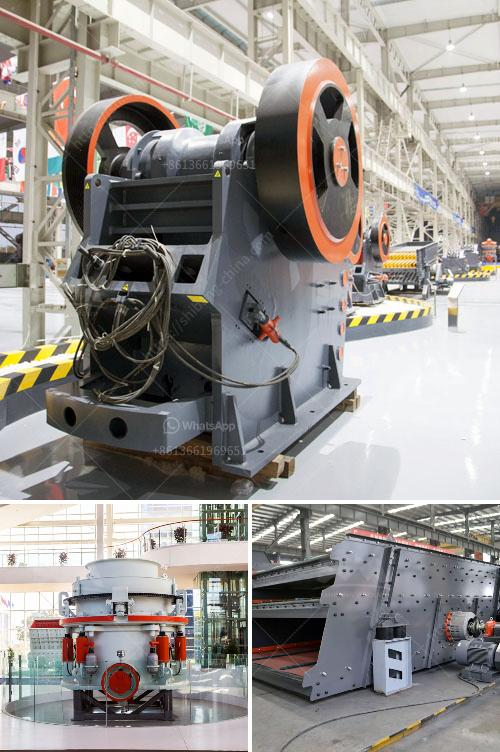

<h3>marble milling machine</h3>
When it comes to turning raw marble into exquisite masterpieces, a marble milling machine plays an integral role in the entire process. With its precision and efficiency, this state-of-the-art tool brings the art of marble carving to new heights. In this article, we will explore the world of marble milling machines, taking a closer look at their features, benefits, and applications.

A marble milling machine is a specialized tool that uses a rotating cutter and advanced technology to shape and carve blocks of marble with utmost precision. These machines are equipped with robust structures and high-powered spindles that allow them to handle heavy-duty milling tasks effectively. In addition, they often incorporate computer numerical control (CNC) technology, enabling operators to program and automate the entire milling process.

One of the standout features of a marble milling machine is its ability to produce highly intricate designs with exceptional accuracy. This is made possible by its precise measurements and movements, resulting in flawless carvings and finishes. Whether it's a detailed sculpture or a finely crafted architectural element, this tool can turn any marble block into a work of art.

Another significant benefit of marble milling machines is their efficiency. With their high-speed cutting capabilities, they can drastically reduce the time required to complete a project. Moreover, their CNC technology allows for continuous and uninterrupted operation, minimizing any chances of errors or imperfections. This not only saves time but also increases productivity, making them an invaluable asset in marble manufacturing facilities.

Furthermore, marble milling machines are incredibly versatile in their applications. They can be used to create a wide range of marble-based products, including statues, fountains, columns, and elaborate architectural details. They are also used in the production of kitchen countertops, bathroom vanities, and various interior design elements. The possibilities are virtually limitless, as these machines provide the freedom to explore intricate and innovative designs.

It's worth noting that the use of marble milling machines is not limited to large-scale manufacturing facilities. Many individual artisans and small businesses also rely on these machines to bring their unique marble creations to life. This level of accessibility has revolutionized the marble industry, democratizing the carving process and allowing talents from all walks of life to flourish.

In conclusion, a marble milling machine combines precision, efficiency, and versatility to elevate the art of marble carving. Its ability to generate flawless designs swiftly has revolutionized the manufacturing process in the marble industry. Whether it's in large-scale production facilities or individual studios, these machines have become an essential tool for artisans and businesses alike. With their remarkable capabilities, they continue to push the boundaries of what can be achieved in marble carving, creating stunning masterpieces that captivate and inspire.
<h3>Contact us</h3><ul><li><strong>Whatsapp:&nbsp;<a href="https://wa.me/8613661969651">+8613661969651</a></strong></li><li><a href="https://swt.shibang-china.com/?git&amp;zhl&amp;marble milling machine"><strong>Online Service(chat now)</strong></a></li></ul><h3>Related</h3><ul><li><a href='jaw crusher for sale in kenya.md'>jaw crusher for sale in kenya</a></li><li><a href='sells crushing plant in osorno.md'>sells crushing plant in osorno</a></li><li><a href='used crushers for sale nigeria.md'>used crushers for sale nigeria</a></li><li><a href='industrial vibrating screens.md'>industrial vibrating screens</a></li><li><a href='cement plant equipment.md'>cement plant equipment</a></li></ul>