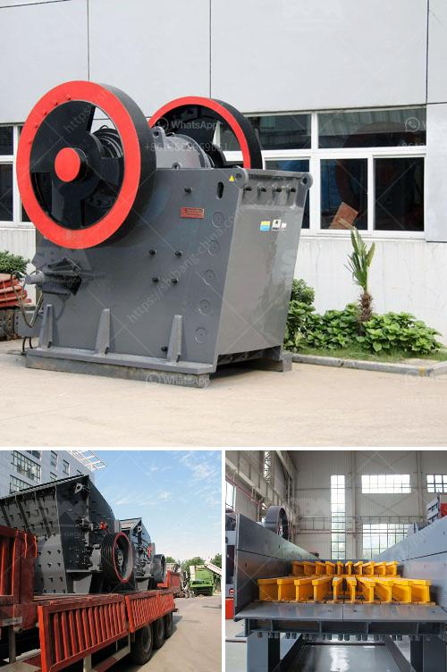

<h3>marble mine processing equipment manufacturers in india</h3>
Marble, also known as natural stone, has been a favored material for constructing buildings and monuments for centuries. With its stunning beauty and durability, it has become a staple in the construction industry. India, known for its rich reserves of marble, is home to numerous marble mines. To extract and process this valuable resource, several manufacturers in India offer top-of-the-line marble mine processing equipment.

One of the leading manufacturers in India is SBM Machinery. They specialize in manufacturing state-of-the-art equipment for the processing of marble, such as hydraulic cone crushers, jaw crushers, impact crushers, and industrial mills. With their extensive experience and expertise, they provide high-quality equipment that ensures efficient and precise processing of the marble mined from the quarries.

Another prominent manufacturer in India is Lomrod, renowned for its cutting-edge machinery and technology. They offer a wide range of marble processing equipment, including gang saws, bridge saws, block cutters, and polishing machines. With their commitment to innovation and customer satisfaction, Lomrod has become a trusted name in the industry.

KalingaStone, a manufacturer based in Rajasthan, India, is also known for its advanced marble processing equipment. They provide a comprehensive range of machineries, including gangsaws, automated line polishers, and resin lines. KalingaStone ensures that their equipment meets international standards and delivers efficient results.

The demand for marble mine processing equipment in India is constantly growing due to the increasing construction projects across the country. Indian manufacturers are stepping up to meet this demand by providing high-quality machinery that adheres to international standards of technology and efficiency. With their cutting-edge equipment, these manufacturers are contributing to the growth and development of the marble industry in India.

In conclusion, India is home to several manufacturers of marble mine processing equipment. These manufacturers offer a diverse range of machinery that aids in the extraction and processing of marble. With their commitment to innovation and quality, they are playing a crucial role in the growth of the marble industry in India.
<h3>Contact us</h3><ul><li><strong>Whatsapp:&nbsp;<a href="https://wa.me/8613661969651">+8613661969651</a></strong></li><li><a href="https://swt.shibang-china.com/?git&amp;zhl&amp;marble mine processing equipment manufacturers in india"><strong>Online Service(chat now)</strong></a></li></ul><h3>Related</h3><ul><li><a href='sand washing machine in ethiopia.md'>sand washing machine in ethiopia</a></li><li><a href='marbel grinder price in pakistan.md'>marbel grinder price in pakistan</a></li><li><a href='100tpd crusher plant.md'>100tpd crusher plant</a></li><li><a href='crushing mill and impact mill.md'>crushing mill and impact mill</a></li><li><a href='kaolin crusher plant in uzbekistan.md'>kaolin crusher plant in uzbekistan</a></li></ul>