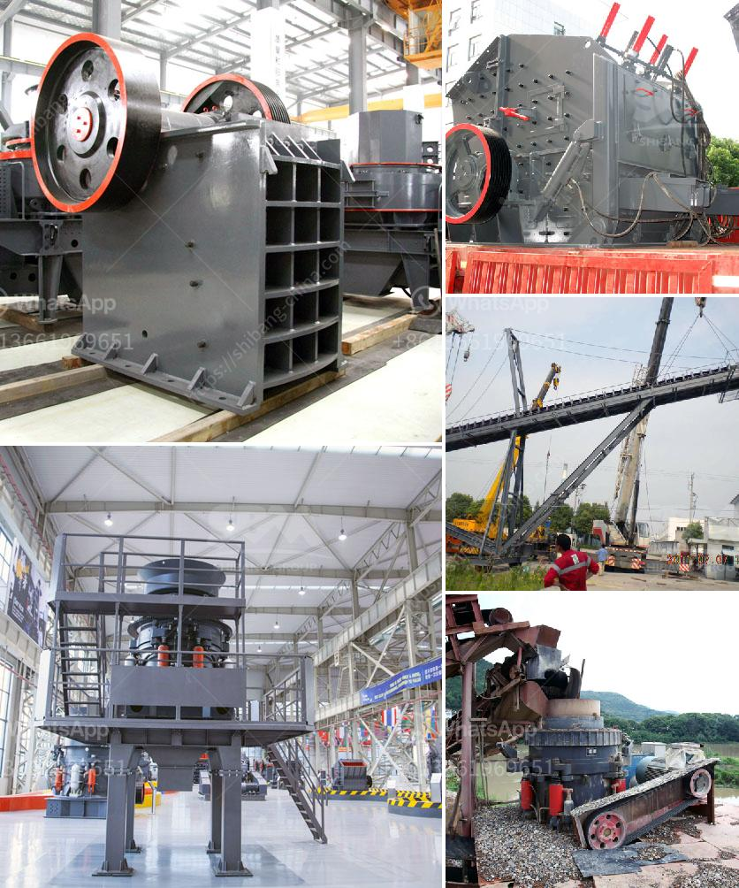

<h3>marble stone milling plant manufacturer</h3>
Marble is a popular building material used for centuries in various cultures and civilizations due to its aesthetic appeal, durability, and versatility. Marble is extracted from quarries in various regions and countries, and it is then processed into different forms, including slabs, tiles, and powders. To achieve the desired form and quality, marble stones undergo several processes, including cutting, shaping, and milling. A vital component in this process is the marble stone milling plant, which is responsible for grinding, shaping, and polishing marble stones into the desired forms.

A marble stone milling plant manufacturer is a company that provides high-quality machinery and equipment needed for marble stone milling and processing. These manufacturers understand the intricacies of the marble stone milling process and have the expertise to design and manufacture machines that can efficiently carry out this task. They offer a range of milling plant options tailored to the specific requirements and scale of the marble stone processing operations.

One of the key advantages of working with a reputable marble stone milling plant manufacturer is the assurance of high-quality machinery. These manufacturers prioritize using top-grade materials and modern manufacturing techniques to ensure the durability, efficiency, and effectiveness of their milling plants. The equipment is designed to withstand the demanding conditions of the milling process and deliver consistent and reliable performance over extended periods.

Efficiency is another crucial factor that distinguishes a reliable marble stone milling plant manufacturer. They understand the importance of optimizing the milling process to minimize wastage and maximize productivity. By incorporating advanced technologies and automation features, these manufacturers offer milling plants that can operate efficiently with minimal manual intervention. This not only reduces operational costs but also improves the overall productivity of the marble stone processing facility.

Additionally, a reputable manufacturer ensures that their milling plants comply with the highest industry standards and safety regulations. They prioritize the safety of the operators and incorporate safety features in the design and construction of their machinery. This helps minimize the risk of accidents and ensures a safe working environment for the personnel involved in the milling process.

Furthermore, a well-established marble stone milling plant manufacturer also provides comprehensive after-sales support and services. They offer installation, maintenance, and repair services to ensure the smooth operation of their milling plants. Their technical team is equipped with the necessary skills and knowledge to address any issues that may arise during the equipment's lifespan.

In conclusion, a marble stone milling plant manufacturer plays a crucial role in the marble stone processing industry. They offer high-quality machinery that is efficient, durable, and safe. By partnering with a reputable manufacturer, businesses can benefit from state-of-the-art milling plants that enhance productivity, reduce costs, and produce superior quality marble products.
<h3>Contact us</h3><ul><li><strong>Whatsapp:&nbsp;<a href="https://wa.me/8613661969651">+8613661969651</a></strong></li><li><a href="https://swt.shibang-china.com/?git&amp;zhl&amp;marble stone milling plant manufacturer"><strong>Online Service(chat now)</strong></a></li></ul><h3>Related</h3><ul><li><a href='large size stone crusher price.md'>large size stone crusher price</a></li><li><a href='roller mill in india.md'>roller mill in india</a></li><li><a href='used clinker grinding mill for sale.md'>used clinker grinding mill for sale</a></li><li><a href='grinder mill in malaysia.md'>grinder mill in malaysia</a></li><li><a href='copper gold processing plant.md'>copper gold processing plant</a></li></ul>