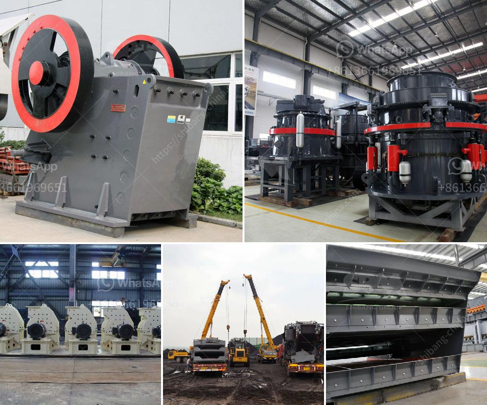

<h3>marble stone milling plant</h3>
Marble, a luxury natural stone with timeless elegance and beauty, has been a popular choice for home and commercial interiors for centuries. From grand stately homes to modern architectural marvels, this exquisite material continues to captivate designers and homeowners alike. But have you ever wondered about the journey this stone takes from being extracted from the earth to becoming a stunning countertop or floor tile? Enter the marble stone milling plant – a vital component in transforming raw marble into finished products that adorn our surroundings.

At the heart of the marble stone milling plant is the efficient and precise milling machinery. With state-of-the-art technology and cutting-edge techniques, these plants can handle the entire process of converting giant blocks of marble into finely crafted pieces that meet the highest industry standards.

The first step in the milling process is block cutting. Gigantic blocks of marble are loaded onto cutting machines that use diamond-tipped blades to slice them into smaller, more manageable pieces. This initial stage requires precision and accuracy to minimize waste and ensure maximum productivity.

After the block cutting process, the marble pieces move onto the milling machines, where they undergo several operations to achieve the desired finish. The milling machines consist of large grinding wheels that rotate at high speeds, precisely shaping and polishing the marble pieces through a series of abrasion and cutting actions. This critical stage gives the marble its characteristic smoothness, sheen, and flawless surface.

Additionally, advanced milling plants use sophisticated CNC technology that allows for precise and intricate design patterns to be etched onto the marble surface. This opens up endless possibilities for custom designs and creates stunning visuals that enhance the aesthetic appeal of the finished product.

Apart from enhancing the aesthetic aspects, marble stone milling plants also contribute to the sustainability and environmental consciousness in the stone industry. Most modern milling plants utilize water recycling systems and dust control mechanisms to minimize wastage and prevent harmful pollutants from being released into the environment. In this way, these plants align with the growing demand for eco-friendly practices and ensure a greener approach to the marble production process.

Furthermore, the marble stone milling plant plays a significant role in job creation and economic growth. From machine operators and technicians to quality control personnel and administrative staff, the plant provides employment opportunities for numerous individuals within the local community. Moreover, the finished marble products contribute to the growth of the construction and interior design industries, generating revenue and fostering economic development.

In conclusion, marble stone milling plants are indispensable in the journey from raw marble to exquisite finished products. With their cutting-edge technology and precision machinery, these plants transform blocks of marble into stunning pieces that grace our homes and public spaces. Not only do these plants offer employment opportunities and economic growth, but they also prioritize sustainability and eco-friendly practices. So, the next time you admire the timeless beauty of marble, remember the essential role played by the marble stone milling plants behind the scenes.
<h3>Contact us</h3><ul><li><strong>Whatsapp:&nbsp;<a href="https://wa.me/8613661969651">+8613661969651</a></strong></li><li><a href="https://swt.shibang-china.com/?git&amp;zhl&amp;marble stone milling plant"><strong>Online Service(chat now)</strong></a></li></ul><h3>Related</h3><ul><li><a href='screening plant philippines.md'>screening plant philippines</a></li><li><a href='detail project report on quartz powder plant.md'>detail project report on quartz powder plant</a></li><li><a href='3 roller pulvarising mill manufacturer.md'>3 roller pulvarising mill manufacturer</a></li><li><a href='types of crushers ppt.md'>types of crushers ppt</a></li><li><a href='grinding mill machine price in namibia.md'>grinding mill machine price in namibia</a></li></ul>