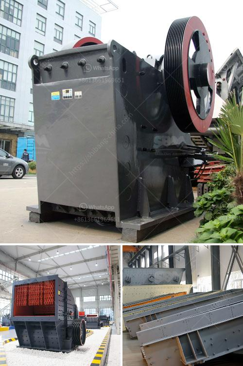

<h3>marble stone sheet production line</h3>
The production of marble stone sheets has revolutionized the construction industry, offering architects and designers an attractive and durable alternative for various applications. With its timeless elegance and exceptional durability, marble has always been a popular choice for adding a touch of luxury to spaces. However, traditional marble slabs can be prohibitively expensive and difficult to install. This is where the marble stone sheet production line comes into play, providing a cost-effective and efficient solution.

The marble stone sheet production line utilizes advanced technology to replicate the natural beauty of marble in a thin, flexible sheet. The process begins with high-quality pulverized marble minerals, which are mixed with resin and other additives. This mixture is then poured into a mold, compacted under pressure, and cured to create a solid sheet. The sheet is then polished and cut into various sizes and thicknesses, ready for use.

One of the greatest advantages of marble stone sheets is their versatility. They can be used in a wide range of applications such as flooring, wall cladding, kitchen countertops, bathroom vanities, and even furniture. The lightweight nature of these sheets makes them easier to transport and install compared to traditional marble slabs. This not only saves time but also reduces labor costs, making it an ideal choice for large-scale construction projects.

Another aspect that sets the marble stone sheet production line apart is the wide variety of colors and patterns available. Through advanced techniques, manufacturers can mimic the unique veining and patterns found in natural marble. This allows designers and architects to achieve the desired aesthetic without compromising on quality.

Moreover, marble stone sheets are incredibly durable and resistant to heat, scratching, and staining. This makes them suitable for both residential and commercial spaces, where high traffic and demanding environments are common. The sheets are also easy to clean and maintain, making them an ideal choice for spaces that require hygiene and cleanliness, such as hospitals and food service areas.

In conclusion, the marble stone sheet production line has transformed the construction industry by providing a cost-effective, versatile, and durable alternative to traditional marble slabs. With its wide range of colors, patterns, and applications, this innovation has opened up a world of possibilities for architects, designers, and property owners. As the trend towards sustainable construction grows, it is no surprise that the demand for marble stone sheets continues to rise.
<h3>Contact us</h3><ul><li><strong>Whatsapp:&nbsp;<a href="https://wa.me/8613661969651">+8613661969651</a></strong></li><li><a href="https://swt.shibang-china.com/?git&amp;zhl&amp;marble stone sheet production line"><strong>Online Service(chat now)</strong></a></li></ul><h3>Related</h3><ul><li><a href='limestone processing plant supplier.md'>limestone processing plant supplier</a></li><li><a href='gold ore crusher for sale.md'>gold ore crusher for sale</a></li><li><a href='zimbabwe hammer mills.md'>zimbabwe hammer mills</a></li><li><a href='100tpd slag cement plant.md'>100tpd slag cement plant</a></li><li><a href='gemstone mining in zambia.md'>gemstone mining in zambia</a></li></ul>