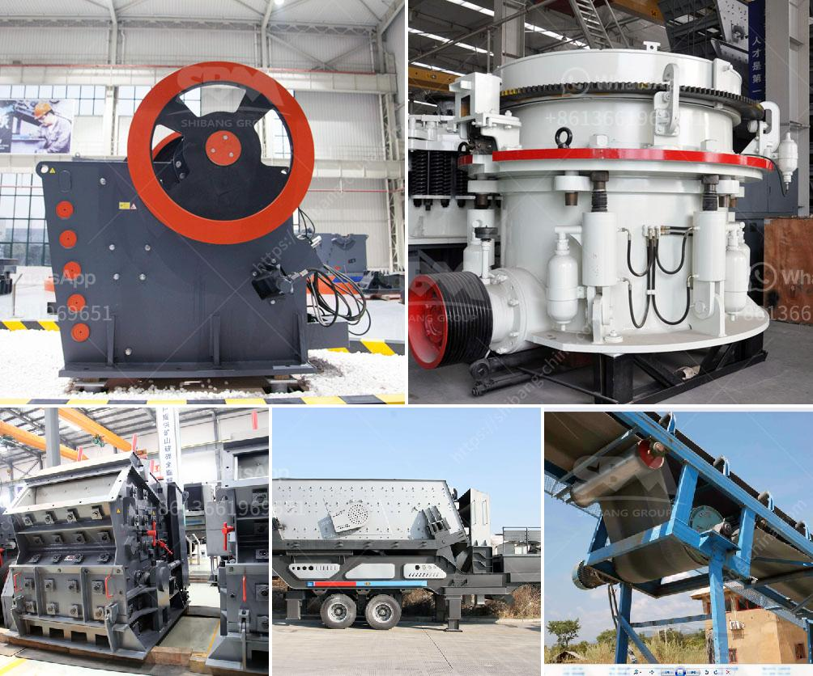

<h3>metal corn crusher in china</h3>
China, known for its vast agricultural lands, has been investing in advanced machinery to enhance the efficiency of farming practices. One such innovation is the metal corn crusher, which has gained immense popularity among farmers across the nation. This machine serves as a crucial tool for corn processing, producing high-quality crushed corn for various purposes.

The metal corn crusher is a robust and durable machine that efficiently grinds corn grains into smaller particles. With its sharp metal blades and rotating mechanism, it ensures consistent and uniform crushing, maintaining the nutritional value of the corn. The versatility of this machine allows farmers to use the crushed corn for livestock feed, biofuel production, or even as a base material for corn-based products in the food industry.

In addition to its efficiency, the metal corn crusher offers significant time and labor-saving benefits. Traditional manual corn crushing methods required farmers to invest considerable effort and time, impacting overall productivity. However, with the advent of metal corn crushers, farmers can now process corn quickly and effortlessly, allowing them to allocate more time to other essential farming activities.

Moreover, the metal corn crusher is known for its energy efficiency. Designed to minimize power consumption while maximizing output, this machine helps farmers reduce their operational costs. This cost-effectiveness, combined with its long lifespan, makes it an attractive investment for farmers of all scales, from small family-owned farms to large commercial enterprises.

Furthermore, the metal corn crusher's popularity can also be attributed to the technological advancements and strict quality control measures implemented by Chinese manufacturers. China has been leading the way in developing state-of-the-art agricultural machinery, ensuring that farmers have access to machines that meet their specific requirements.

In conclusion, the metal corn crusher has revolutionized corn processing in China. Its efficiency, time-saving capabilities, energy efficiency, and quality output have made it an indispensable tool for farmers across the nation. With ongoing advancements in technology, it is expected that the metal corn crusher will continue to evolve, further enhancing agricultural practices in China and beyond.
<h3>Contact us</h3><ul><li><strong>Whatsapp:&nbsp;<a href="https://wa.me/8613661969651">+8613661969651</a></strong></li><li><a href="https://swt.shibang-china.com/?git&amp;zhl&amp;metal corn crusher in china"><strong>Online Service(chat now)</strong></a></li></ul><h3>Related</h3><ul><li><a href='to produce tons of li ne powder.md'>to produce tons of li ne powder</a></li><li><a href='working machine of a stone crusher.md'>working machine of a stone crusher</a></li><li><a href='100 tons hour gold wash plant.md'>100 tons hour gold wash plant</a></li><li><a href='quartz grits plant machinery.md'>quartz grits plant machinery</a></li><li><a href='slag grinding mill india.md'>slag grinding mill india</a></li></ul>