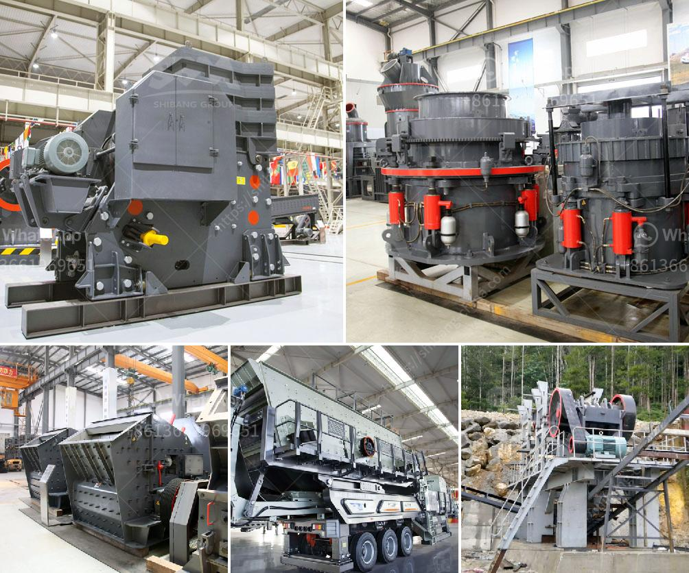

<h3>method statement for using mobile jaw crusher</h3>
On construction sites, the contractor is responsible for ensuring all operators are fully trained on the use of mobile jaw crushers and any associated equipment. Here, we will outline the appropriate method statement for the use of mobile jaw crushers.

Before starting the operation, the operator should ensure that all components of the mobile jaw crusher are in good working condition. This includes inspecting the machine for any defects or damages, checking the oil level, ensuring the batteries are fully charged, and confirming the correct functioning of safety features such as emergency stops and fire extinguishers.

All personnel involved in the operation should be wearing appropriate PPE. This includes safety helmets, high visibility clothing, safety glasses, ear protection, and steel-toe boots. PPE is essential to protect workers from potential hazards like falling debris and excessive noise.

The contractor should ensure a clear and safe working area around the mobile jaw crusher. This includes proper access and egress paths for operators and other personnel, barricades or barriers to prevent unauthorized access, and appropriate traffic control measures to protect workers and other site visitors.

Once the machine is properly set up and all safety checks have been completed, the operator should start the mobile jaw crusher following the manufacturer's guidelines. This typically involves activating the engine, engaging the hydraulic system, and confirming the correct settings for the material being crushed.

Before loading material into the mobile jaw crusher, the operator should ensure that the feed hopper is clear of any debris or obstructions. This is crucial to prevent blockages and potential damage to the machine. The material should be evenly distributed across the entire width of the feed opening to avoid uneven wear on the jaw plates.

The operator should closely monitor the crushing process and adjust the settings as necessary to achieve the desired product size and production rate. Regularly inspect the jaw plates for wear and replace them when needed to maintain optimal performance. The mobile jaw crusher should be operated within its designed capacity and limitations to prevent any mechanical failures.

Regular maintenance and repair are crucial to ensure the mobile jaw crusher operates safely and efficiently. The operator should follow the manufacturer's recommended maintenance schedule for tasks such as lubrication, filter replacements, and inspections of belts, hoses, and electrical connections. The machine should be regularly serviced by qualified technicians to address any mechanical issues promptly.

In the event of an emergency, such as a fire, equipment malfunction, or an injury, the operator should be familiar with the site's emergency procedures. This includes knowing the location of emergency stops, fire extinguishers, and first aid kits. The operator should also be trained in first aid and know how to contact emergency services if necessary.

In conclusion, the proper use of a mobile jaw crusher requires careful preparation, adherence to safety protocols, and regular maintenance. By following the appropriate method statement, operators can ensure the safe and efficient operation of the machine, protecting both personnel and the equipment itself.
<h3>Contact us</h3><ul><li><strong>Whatsapp:&nbsp;<a href="https://wa.me/8613661969651">+8613661969651</a></strong></li><li><a href="https://swt.shibang-china.com/?git&amp;zhl&amp;method statement for using mobile jaw crusher"><strong>Online Service(chat now)</strong></a></li></ul><h3>Related</h3><ul><li><a href='stone crusher plant ton per hour.md'>stone crusher plant ton per hour</a></li><li><a href='primary stone crusher for rent in karnataka.md'>primary stone crusher for rent in karnataka</a></li><li><a href='ball mill for size reduction.md'>ball mill for size reduction</a></li><li><a href='mobile stone crushers in usa.md'>mobile stone crushers in usa</a></li><li><a href='200 tph stone crusher price.md'>200 tph stone crusher price</a></li></ul>