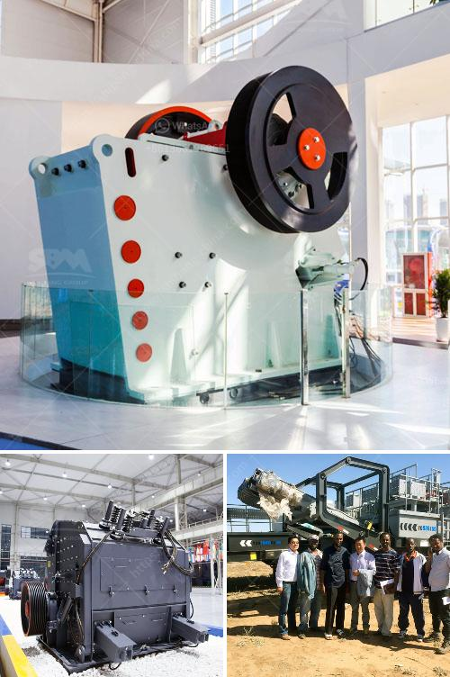

<h3>mica processing machinery pictures</h3>
Mica is a naturally occurring mineral that is widely used in various industries for its unique properties. It is known for its exceptional electrical and thermal insulation, high heat resistance, and chemical stability. The demand for mica continues to grow, and as a result, the need for efficient mica processing machinery has become essential.

Mica processing machinery plays a crucial role in extracting mica flakes and creating mica powder for various applications. These machines are used to crush and grind mica minerals into smaller particles, which are then processed further to obtain the desired product.

One of the primary machines used in mica processing is the mica crusher. It helps in crushing large chunks of mica into smaller pieces that can be easily handled and processed. The mica crusher comes in various sizes and capacities to cater to different processing requirements. It utilizes a robust mechanism to break down the mica minerals effectively.

The mica grinder is another essential piece of equipment used in mica processing. It is used to grind the mica particles into a fine powder that can be used in industries like cosmetics, paints, plastics, and rubber. The mica grinder operates through a series of spinning blades or discs that crush and grind the mica particles with precision and consistency.

To achieve the desired smoothness and fineness, mica processing machinery may include additional equipment such as sifters, classifiers, and separators. These machines ensure that the mica powder is of high quality and free from impurities. They help in removing any unwanted particles or debris from the processed mica.

Mica processing machinery is designed to be versatile, efficient, and environmentally friendly. Many modern mica processing machines are equipped with advanced technologies that optimize the production process while minimizing energy consumption and waste generation. Some machines are also designed to be automated, reducing the need for manual labor and increasing overall productivity.

Pictures of mica processing machinery provide a visual representation of the different types of machines used in the mica processing industry. These pictures showcase the various components and mechanisms involved in crushing, grinding, and refining mica minerals. They also demonstrate the size, design, and layout of the machinery used in mica processing facilities.

Moreover, these pictures help prospective buyers or investors understand the capabilities and features of different mica processing machinery. They provide a valuable reference for making informed decisions and selecting the appropriate machines based on specific processing requirements.

In conclusion, mica processing machinery plays a crucial role in extracting and refining mica minerals for various industries. These machines are used to crush, grind, and refine mica particles, resulting in high-quality mica powder. Pictures of mica processing machinery provide a visual representation of the different machines used and help in understanding their features and capabilities. Investing in efficient and advanced mica processing machinery is essential to meet the growing demand for mica and ensure the production of high-quality products.
<h3>Contact us</h3><ul><li><strong>Whatsapp:&nbsp;<a href="https://wa.me/8613661969651">+8613661969651</a></strong></li><li><a href="https://swt.shibang-china.com/?git&amp;zhl&amp;mica processing machinery pictures"><strong>Online Service(chat now)</strong></a></li></ul><h3>Related</h3><ul><li><a href='ball mill made in usa.md'>ball mill made in usa</a></li><li><a href='jaw crusher price south africa.md'>jaw crusher price south africa</a></li><li><a href='stone crusher machine pr ice in nepal.md'>stone crusher machine pr ice in nepal</a></li><li><a href='best crusher for quartz powder.md'>best crusher for quartz powder</a></li><li><a href='used coal washing plants for sale in pakistan.md'>used coal washing plants for sale in pakistan</a></li></ul>