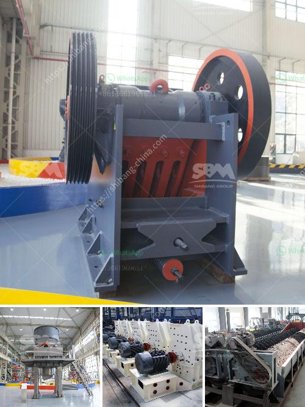

<h3>micro crushers plant</h3>
Micro crushers plants are revolutionary equipment in the construction industry that have gained immense popularity in recent years. These compact and powerful machines are designed to crush various materials, such as concrete, rocks, and stones, into smaller sizes for easy disposal or recycling purposes. With their ability to efficiently break down materials on-site, micro crushers plants offer numerous advantages, making them a game-changer in the construction sector.

One of the key benefits of micro crushers plants is their small size and portability. Unlike traditional crushers, which are often large and bulky, these micro crushers plants are compact and lightweight, making them easy to transport and maneuver. This portability allows construction companies to bring the crushing operation directly to the construction site, eliminating the need to transport materials to a central processing facility. As a result, time and money are saved, as well as reducing the environmental impact associated with transportation.

In addition to their portability, micro crushers plants are incredibly powerful. Despite their small size, these machines have a high crushing capacity, enabling them to process large amounts of material efficiently. They are equipped with advanced technology and robust engines that can crush a wide range of materials, including concrete, asphalt, bricks, tiles, and rocks, into smaller, more manageable sizes.

Moreover, micro crushers plants are extremely versatile and can be used in various applications. They are commonly used in the demolition and construction industry to crush and recycle materials from demolished structures. By recycling these materials, construction companies can save on disposal costs and reduce the need for new raw materials, making the construction process more sustainable and environmentally friendly.

Micro crushers plants are also beneficial in road construction projects. They can efficiently crush rocks and stones to produce aggregates that are used in the construction of roads and highways. These aggregates are essential in providing a solid foundation and durability to road surfaces, enhancing their lifespan and reducing maintenance costs.

Furthermore, micro crushers plants are highly efficient in reducing waste. By crushing materials on-site, construction companies can minimize waste generation and landfill usage. This not only saves costs associated with waste management but also contributes to a greener and more sustainable construction industry.

Overall, micro crushers plants are becoming increasingly popular in the construction industry for their compact size, portability, and high crushing capacity. With the ability to crush materials on-site, these machines offer a cost-effective and efficient solution for construction projects. Not only do they save time and money, but they also promote sustainability by reducing the need for transportation and minimizing waste generation. As construction companies strive to adopt more environmentally friendly practices, micro crushers plants are proving to be an invaluable asset, revolutionizing the way materials are recycled and reused in construction projects.
<h3>Contact us</h3><ul><li><strong>Whatsapp:&nbsp;<a href="https://wa.me/8613661969651">+8613661969651</a></strong></li><li><a href="https://swt.shibang-china.com/?git&amp;zhl&amp;micro crushers plant"><strong>Online Service(chat now)</strong></a></li></ul><h3>Related</h3><ul><li><a href='nigeria crusher plant 200 tph.md'>nigeria crusher plant 200 tph</a></li><li><a href='gold ore crusher for sale.md'>gold ore crusher for sale</a></li><li><a href='work method statement for jaw crusher.md'>work method statement for jaw crusher</a></li><li><a href='stone crusher rubber conveyor.md'>stone crusher rubber conveyor</a></li><li><a href='ball mill in egypt.md'>ball mill in egypt</a></li></ul>