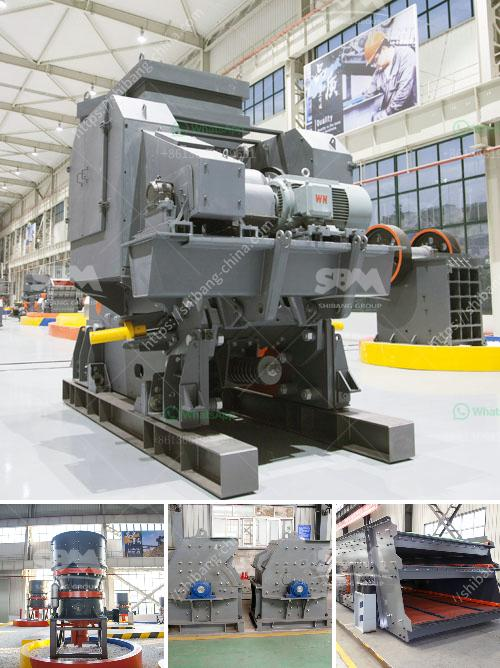

<h3>micron grinding mill nigeria</h3>
Nigeria is blessed with a wide range of mineral resources, which include natural gas, coal, bauxite, tantalite, gold, tin, iron ore, limestone, niobium, lead, and zinc. Despite huge deposits of these natural resources, the mining industry in Nigeria is still in its infancy. Manufacturing industries rely heavily on imported raw materials, which can be expensive and sometimes scarce. To harness Nigeria's mineral resources and make them more valuable, there is a need for efficient and reliable processing equipment such as the micron grinding mill.

The micron grinding mill is a high-tech equipment capable of processing mineral materials into fine and ultra-fine powders. The mill developed by HCMilling(Guilin Hongcheng) breaks through the bottleneck of traditional grinding mills. It is widely used in industries such as bauxite, marble, limestone, manganese ore, iron ore, ilmenite, phosphate rock, bentonite, starch, kaolin, etc.

In recent years, with the emphasis on environmental protection in Nigeria, and the introduction of new policies such as the ban on mining, it has become necessary to improve the grinding system and develop environmentally friendly micron grinding mills. This is where HCMilling comes in. HCMilling follows strict environmental standards in the design, manufacturing, and production of equipment, ensuring compliance with regulations while meeting the requirements of customers.

The micron grinding mill is able to process minerals into finished products between 325-2500 mesh (fineness). Besides, HCMilling also provides customized grinding mill services. Customers can choose different types of grinding mills according to their own production requirements to meet the needs of mineral powder processing.

The micron grinding mill equipment is an advanced equipment that can effectively increase the unit output of a single device and reduce the energy consumption per unit output of the equipment. It is a device that promotes the fine powder deep processing project. With the development of the mineral powder market, the application value of the micro powder grinding mill is getting higher and higher. Developing high-purity ultra-fine powder processing equipment can help Nigeria benefit more from its mineral resources and create more economic value.

In conclusion, the micron grinding mill Nigeria deserves to be recognized as a high-tech and environmentally friendly facilitator, facilitating the transformation and utilization of Nigeria's mineral resources in the mining and manufacturing industries. The mill further promotes the development of the Nigerian economy and creates benefits for society. It is undeniably a vital equipment in the Nigerian mining industry that contributes significantly to the country's economic growth and development.
<h3>Contact us</h3><ul><li><strong>Whatsapp:&nbsp;<a href="https://wa.me/8613661969651">+8613661969651</a></strong></li><li><a href="https://swt.shibang-china.com/?git&amp;zhl&amp;micron grinding mill nigeria"><strong>Online Service(chat now)</strong></a></li></ul><h3>Related</h3><ul><li><a href='bauxite mining machine.md'>bauxite mining machine</a></li><li><a href='mining equipment bow mills in zimbabwe.md'>mining equipment bow mills in zimbabwe</a></li><li><a href='uk quarry crusher machinery manufacturers.md'>uk quarry crusher machinery manufacturers</a></li><li><a href='400 tph mobile coal crusher plant manufacturer.md'>400 tph mobile coal crusher plant manufacturer</a></li><li><a href='italy stone crusher manufacter.md'>italy stone crusher manufacter</a></li></ul>