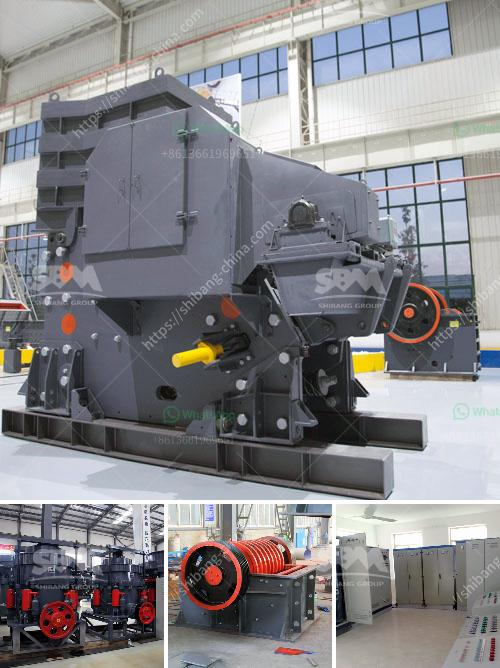

<h3>mill price for minerals in bolivia</h3>
The mill price for minerals in Bolivia has been a topic of great significance and debate in recent years. Bolivia, a landlocked country located in the heart of South America, is known for its rich mineral resources, including silver, tin, zinc, lead, and gold. These minerals play a crucial role in the country's economy and have long been a source of national pride.

The mill price refers to the price at which minerals are bought and sold at the mills, which are processing facilities where raw ore is transformed into refined minerals ready for export. The mill price is influenced by various factors, including global demand and supply dynamics, mining regulations, operational costs, and geopolitical factors.

One of the key challenges faced by the Bolivian mining industry is its heavy reliance on foreign investment and volatile global commodity prices. Fluctuations in international prices can significantly impact the mill price for minerals in Bolivia. For example, during periods of high demand and soaring prices, mining companies operating in Bolivia can enjoy substantial profits. On the other hand, during times of low global demand or price crashes, the mill price can plummet, leading to economic hardships for both mining companies and the Bolivian government.

Additionally, mining regulations and policies can have a considerable impact on the mill price for minerals. Over the years, Bolivia has experienced numerous changes in its mining legislation, aimed at increasing state control and maximizing benefits for the country. In 2006, the Bolivian government enacted a law that required mining companies to sign new contracts known as mining contracts. These contracts stipulated that mining companies had to sell their minerals to the state-owned mining company, Comibol, at mill prices determined by the government.

The introduction of new mining contracts and state control over mill prices caused controversy within the mining industry. While the government argued that these measures would ensure more equitable distribution of wealth and allow Bolivia to benefit from its natural resources, critics argued that such policies discouraged foreign investment and hindered the industry's growth. This debate highlights the delicate balance that must be struck between protecting national interests and promoting a favorable investment climate.

Operational costs also play a significant role in determining the mill price for minerals. Mining is a capital-intensive industry that requires substantial investments in infrastructure, equipment, and labor. In Bolivia, as in many other countries, mining companies must factor in operational costs such as labor wages, energy costs, transportation expenses, and environmental regulations when setting the mill price. Moreover, fluctuations in these costs can further impact the profitability and overall competitiveness of the mining sector.

In conclusion, the mill price for minerals in Bolivia is influenced by a multitude of factors, including global demand and supply dynamics, mining regulations, operational costs, and geopolitical considerations. The challenge for the Bolivian government and mining industry stakeholders is to strike a balance between promoting national interests, attracting foreign investment, and ensuring a sustainable and profitable mining sector. With careful planning, transparent policies, and effective communication, Bolivia can continue to thrive as a significant player in the global mining industry.
<h3>Contact us</h3><ul><li><strong>Whatsapp:&nbsp;<a href="https://wa.me/8613661969651">+8613661969651</a></strong></li><li><a href="https://swt.shibang-china.com/?git&amp;zhl&amp;mill price for minerals in bolivia"><strong>Online Service(chat now)</strong></a></li></ul><h3>Related</h3><ul><li><a href='200 500 tph bauxite mining and processing plant.md'>200 500 tph bauxite mining and processing plant</a></li><li><a href='coal cushing and gdrinding machine.md'>coal cushing and gdrinding machine</a></li><li><a href='mobile stone crushing plant made in germany.md'>mobile stone crushing plant made in germany</a></li><li><a href='vibrating grinding mill ball china.md'>vibrating grinding mill ball china</a></li><li><a href='gypsum processing equipment.md'>gypsum processing equipment</a></li></ul>