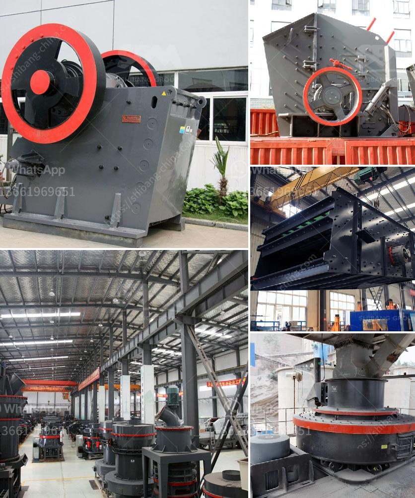

<h3>mills road crusher machine</h3>
Road construction has always been a challenging task, requiring the use of heavy machinery and equipment to ensure quality and durability. However, with technological advancements in recent years, the process has become more efficient and cost-effective. One such innovation is the Mills Road Crusher Machine, which offers a revolutionary approach to road construction.

The Mills Road Crusher Machine, developed by a team of engineers at Mills Innovations, is transforming road construction with its ability to crush rocks and asphalt on-site. This innovative technology eliminates the need for hauling discarded materials to landfills, reducing costs and environmental impact.

Traditional road construction methods often involve removing existing road surfaces and transporting them to disposal sites, where they are crushed and processed before being reused. This process is time-consuming, expensive, and contributes to carbon emissions, as heavy machinery needs to transport materials over long distances.

In contrast, the Mills Road Crusher Machine can crush rocks and asphalt in situ, reducing the need for transportation and disposal. With its powerful crushing mechanism, it breaks down materials into smaller, reusable pieces that can be directly used in road construction. This not only saves time and money but also minimizes carbon emissions by eliminating the need for transportation.

Additionally, the Mills Road Crusher Machine is versatile and adaptable to various road construction projects. It can crush different types of materials, including rocks of different sizes and densities, as well as various types of asphalt. This makes it suitable for a wide range of applications, from small road repairs to large-scale construction projects.

Furthermore, the machine's compact design allows it to operate in tight spaces, such as urban areas, where traditional machinery may struggle to maneuver. Its efficient crushing process ensures minimal noise pollution, making it ideal for use in residential areas without causing disturbance to nearby residents.

The Mills Road Crusher Machine is also equipped with advanced safety features to protect operators and workers. It includes a sensor system that detects any obstructions in its path, automatically halting its operation to avoid accidents. The machine's control panel provides operators with real-time information about its performance, allowing them to monitor and adjust operations as needed.

The environmental benefits of the Mills Road Crusher Machine are significant. By eliminating the need for transportation and disposal of materials, it reduces carbon emissions and helps conserve natural resources. The machine's in-situ crushing process minimizes disruption to the surrounding environment, further reducing its ecological impact.

In conclusion, the Mills Road Crusher Machine offers a game-changing solution to road construction. Its ability to crush rocks and asphalt on-site eliminates the need for transportation and disposal of materials, reducing costs, carbon emissions, and environmental impact. With its versatility, adaptability, and advanced safety features, it is revolutionizing the way road construction projects are undertaken. As technology continues to evolve, innovative solutions like the Mills Road Crusher Machine will play a crucial role in transforming the construction industry into a more sustainable and efficient sector.
<h3>Contact us</h3><ul><li><strong>Whatsapp:&nbsp;<a href="https://wa.me/8613661969651">+8613661969651</a></strong></li><li><a href="https://swt.shibang-china.com/?git&amp;zhl&amp;mills road crusher machine"><strong>Online Service(chat now)</strong></a></li></ul><h3>Related</h3><ul><li><a href='malaysia coconut grinder machine.md'>malaysia coconut grinder machine</a></li><li><a href='ball grinding machine manufacturer in india.md'>ball grinding machine manufacturer in india</a></li><li><a href='diamond screening plant for hire south africa.md'>diamond screening plant for hire south africa</a></li><li><a href='cement plant tons per day.md'>cement plant tons per day</a></li><li><a href='ball mill in kazakhstan.md'>ball mill in kazakhstan</a></li></ul>