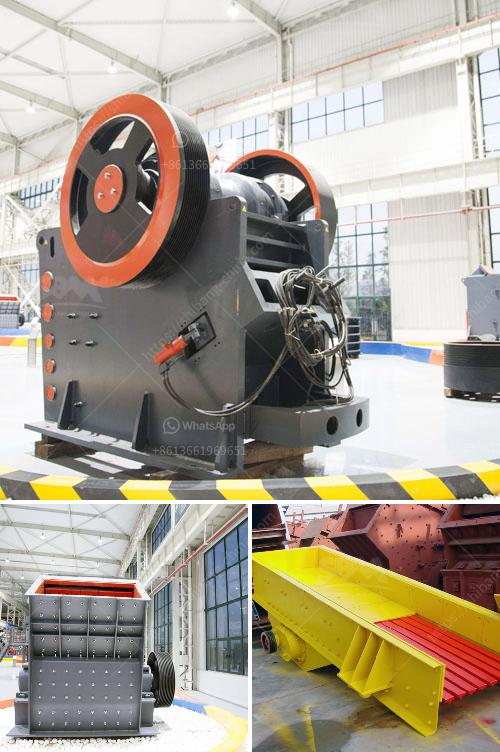

<h3>mineral materials crusher</h3>
Mining and construction industries heavily rely on crushing equipment to break down large rocks, minerals, and stones into smaller pieces. Crushing machinery plays a crucial role in many industrial sectors, including metallurgy, mining, construction, and chemical industries. Among the various options available, the mineral materials crusher stands out as an indispensable tool for efficient crushing operations.

The mineral materials crusher is a type of machine that is used to reduce large rocks into smaller pieces or dust particles. These machines have a wide range of applications, including the crushing of limestone, shale, coal, dolomite, gypsum, and other rocks. They play a vital role in the extractive and construction industries, where the raw material quality determines the final product's quality.

One of the key advantages of mineral materials crushers is their ability to handle a wide range of materials, even those of high hardness. This adaptability allows the crushing machinery to process different types of rocks, making it a versatile tool for various applications. In addition, these crushers are designed to produce consistent and uniform particle sizes, ensuring the quality and consistency of the final product.

The mineral materials crusher is typically equipped with various components, such as a feeder, hopper, conveyor belts, and control panels. These components work together to efficiently process and transport the raw materials. For instance, the feeder ensures a steady and controlled flow of materials into the crusher, while the conveyor belts transport the crushed material to the desired location.

Crushers come in different sizes and configurations, with the most commonly used types being jaw crushers, impact crushers, and cone crushers. Jaw crushers are designed to handle large rocks and are often used in the primary crushing phase. Impact crushers, on the other hand, are versatile machines that can handle both primary and secondary crushing. Lastly, cone crushers are often used for fine crushing operations and to produce a finer product size.

Efficiency and productivity are key factors when choosing a mineral materials crusher. These machines are designed to optimize the crushing process, enhancing overall productivity while minimizing energy consumption and operational costs. Modern crushers are equipped with advanced technologies that enable faster, more efficient crushing operations. Some crushers are also equipped with automation features that allow remote monitoring and control, further improving operational efficiency.

Importantly, mineral materials crushers contribute to sustainable mining practices by optimizing the use of available resources. By crushing rocks into smaller sizes, these crushers reduce the need for additional raw materials, such as cement or aggregates, which reduces the overall environmental impact and conserves natural resources. Moreover, the use of crushers can also reduce waste and facilitate recycling initiatives within the industry.

In conclusion, the mineral materials crusher is an essential device for mining and construction industries. Its ability to handle a wide range of materials, produce consistent particle sizes, and optimize resource utilization makes it a valuable tool for various applications. As technology advances, crushing machinery will continue to evolve, becoming more efficient, eco-friendly, and versatile, further enhancing its significance in the mining and construction sectors.
<h3>Contact us</h3><ul><li><strong>Whatsapp:&nbsp;<a href="https://wa.me/8613661969651">+8613661969651</a></strong></li><li><a href="https://swt.shibang-china.com/?git&amp;zhl&amp;mineral materials crusher"><strong>Online Service(chat now)</strong></a></li></ul><h3>Related</h3><ul><li><a href='cost of 500 tonnes per day cement plant ecuador.md'>cost of 500 tonnes per day cement plant ecuador</a></li><li><a href='manganese ore beneficiation plant china.md'>manganese ore beneficiation plant china</a></li><li><a href='india type cone crusher.md'>india type cone crusher</a></li><li><a href='mill price for minerals in bolivia.md'>mill price for minerals in bolivia</a></li><li><a href='crusher stone for sale.md'>crusher stone for sale</a></li></ul>