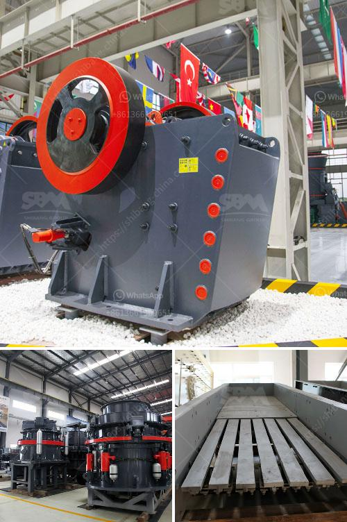

<h3>mineral used for making talcum powder</h3>
Talcum powder finds wide application in various industries, including personal care products, cosmetics, and even baby powders. The primary mineral used to produce this versatile powder is talc. Talc is a naturally occurring mineral that undergoes processing to remove impurities and provide the smooth, silky texture associated with talcum powder. This article aims to shed light on the mineral used in making talcum powder and its various properties.

Talc is a metamorphic mineral primarily composed of magnesium, silicon, and oxygen. It is formed through the transformation of rocks rich in magnesium and silica under intense heat and pressure. Due to its softness, talc can be easily ground into a fine powder, making it an ideal mineral for various applications.

The processing of talc involves crushing and grinding the raw talc to produce a fine powder. The resultant powder is then purified to eliminate any impurities, enhancing its quality and safety for personal care use. The unique properties of talc render it an ideal choice for many products. Talcum powder possesses exceptional absorbent properties, making it effective in reducing skin moisture and friction, thus preventing rashes and discomfort. Its fine texture contributes to its smoothness, making it an ideal additive for body and face powders, as well as various cosmetic products.

In recent years, talcum powder has faced controversy regarding its potential link to ovarian cancer. Concerns arose due to the presence of asbestos, a known carcinogen, in some talc deposits. To address these concerns, the cosmetics industry uses talc that is carefully selected and tested to ensure its asbestos-free status. Independent testing ensures that talcum powder widely available today is safe for use, although some companies have embraced alternative ingredients to provide consumers with additional options.

Talcum powder has been a staple in personal care routines for many years, owing to its numerous benefits and unique properties. Composed of the mineral talc, this fine powder is crafted through a rigorous processing and purification process to maximize its effectiveness and safety. While the safety of talcum powder has been a subject of debate in recent times, the industry has implemented strict measures to deliver asbestos-free products. Consumers can continue to enjoy the comforting and soothing properties of talcum powder with peace of mind, courtesy of meticulous testing and production practices.
<h3>Contact us</h3><ul><li><strong>Whatsapp:&nbsp;<a href="https://wa.me/8613661969651">+8613661969651</a></strong></li><li><a href="https://swt.shibang-china.com/?git&amp;zhl&amp;mineral used for making talcum powder"><strong>Online Service(chat now)</strong></a></li></ul><h3>Related</h3><ul><li><a href='business plan for small scale chrome mining.md'>business plan for small scale chrome mining</a></li><li><a href='used stone crusher machine from japan.md'>used stone crusher machine from japan</a></li><li><a href='mobile crusher in sweden.md'>mobile crusher in sweden</a></li><li><a href='rock crusher rock crusher.md'>rock crusher rock crusher</a></li><li><a href='precio trituradora de tierras en pakistan.md'>precio trituradora de tierras en pakistan</a></li></ul>