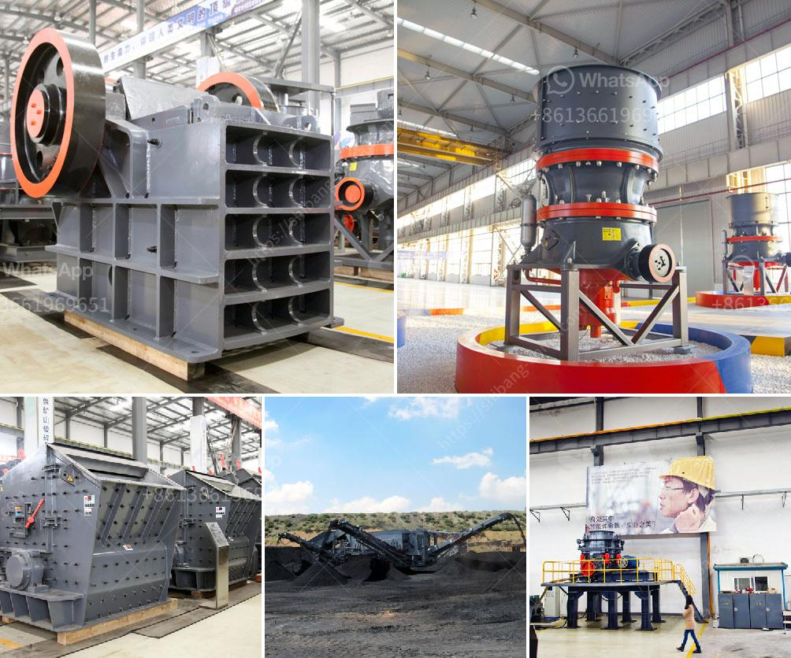

<h3>mini cement plant in pakistan</h3>
The cement industry is a crucial part of Pakistan's economy. Pakistan has recently stepped up efforts to boost the sector, as the country struggles to overcome its energy crisis, which has led to long-standing power shortages. The mini cement plant has been a popular choice for most of the investors lately. It is developed and introduced to facilitate and help the investors in getting desired cement manufacturing capacity on the small-scale sector. 

Mini cement plants are categorically called as small-scale cement production units and they are fabricated and installed with varying production capacities, ranging from 20 to 100 tpd. In Pakistan, these mini cement plants can produce cement up to 1,250 tons per day, making them an ideal choice for both new and existing operators.

One of the main advantages of mini cement plants in Pakistan is the simplified production process compared to larger plants. With newer technology advancements, mini cement plants offer simplified options for raw material extraction, grinding, and packing. These plants require less space, less man-power, and usually have lower, more affordable investment costs.

Most of the mini cement plants in Pakistan are found in the Punjab and Khyber Pakhtunkhwa provinces. This is mainly due to the high demand for cement in those areas, as they are witnessing rapid urbanization and growing infrastructural developments. Having mini cement plants closer to the cities and construction projects also helps reduce transportation costs and ensures timely delivery of cement.

The mini cement plant industry in Pakistan is expected to gradually grow due to the construction activities across the country. In recent years, the government has taken initiatives like the China-Pakistan Economic Corridor (CPEC), which has led to various infrastructural projects, thus boosting the cement industry.

Moreover, the increased demand for housing, commercial buildings, and infrastructure projects has created a favorable market for cement manufacturers in Pakistan. The mini cement plants cater to the local demand and are cost-effective, enabling them to compete with the larger cement manufacturing giants in the market.

In addition to facilitating the local market, mini cement plants can also contribute to the country's export sector. Pakistan has been exporting cement to neighboring countries like Afghanistan, India, and Central Asian states. The mini cement plants, with increased production capacity, can play a significant role in increasing Pakistan's cement exports and generating more revenue for the country.

However, it is important to address the challenges that come with mini cement plants in Pakistan. These challenges mostly relate to compliance with environmental regulations, sustainable extraction of raw materials, and ensuring quality control during the production process. The government needs to provide guidelines and regulations for the establishment and operation of mini cement plants to ensure that they meet international standards and minimize any adverse environmental impact.

In conclusion, mini cement plants in Pakistan have become a viable investment option due to their simplified production process, lower investment costs, and potential for growth in the local and export markets. It is important for the government and stakeholders to support and regulate the industry to ensure sustainable and responsible manufacturing practices.
<h3>Contact us</h3><ul><li><strong>Whatsapp:&nbsp;<a href="https://wa.me/8613661969651">+8613661969651</a></strong></li><li><a href="https://swt.shibang-china.com/?git&amp;zhl&amp;mini cement plant in pakistan"><strong>Online Service(chat now)</strong></a></li></ul><h3>Related</h3><ul><li><a href='slag grindimg in ball mill.md'>slag grindimg in ball mill</a></li><li><a href='small gypsum crushing machines australia.md'>small gypsum crushing machines australia</a></li><li><a href='lavadora de arena en mexico.md'>lavadora de arena en mexico</a></li><li><a href='feldspar grinding in raymond mill.md'>feldspar grinding in raymond mill</a></li><li><a href='screens hammer mills.md'>screens hammer mills</a></li></ul>