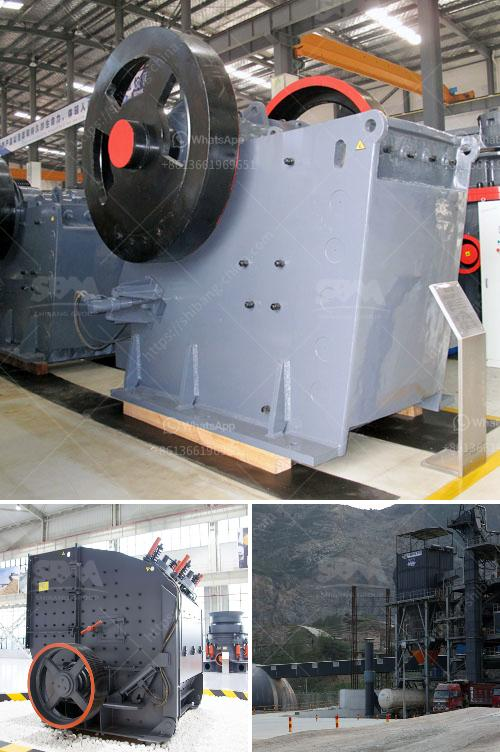

<h3>mini coke processing plant</h3>
In recent years, the demand for carbonated beverages like cola has skyrocketed, fueling the need for efficient and cost-effective processing plants. The introduction of mini coke processing plants has revolutionized the beverage industry, providing a solution for smaller businesses and startups to enter the market without heavy capital investment.

A mini coke processing plant is a compact facility designed to produce carbonated beverages on a smaller scale. With a production capacity ranging from 2,000 to 10,000 liters per hour, these plants offer a cost-effective alternative to large-scale factories while maintaining high-quality standards.

One of the key advantages of mini coke processing plants is their modular design. They can be easily assembled and disassembled, allowing for flexibility in terms of location and production volume. This feature is especially beneficial for businesses operating in remote areas or those looking to gradually expand their operations.

Another significant advantage is the reduced energy consumption. Mini coke processing plants utilize advanced technology and efficient systems, leading to lower energy and water usage. This not only helps the environment but also reduces operating costs, making them an attractive option for small and medium-sized enterprises.

Moreover, the processing plants are equipped with automated controls and monitoring systems, ensuring consistently high product quality. Modern manufacturing techniques, strict quality control, and hygienic processes guarantee that every bottle of cola produced in these facilities meets industry standards and consumer expectations.

For businesses that prioritize customization, mini coke processing plants offer flexibility in recipe formulation and packaging options. They can tailor the taste and carbonation levels of their cola, as well as choose from a variety of packaging sizes and materials, such as glass bottles or PET containers.

The mini coke processing plants have opened up new opportunities for entrepreneurs and local communities. They provide a platform for business growth and job creation, enabling individuals to tap into the beverage industry's potential without major financial risks.

In conclusion, mini coke processing plants have revolutionized the beverage industry by providing a cost-effective, energy-efficient, and flexible solution for small and medium-sized enterprises. With their modular design, advanced technology, and customization possibilities, these plants are reshaping the way carbonated beverages are produced, distributed, and enjoyed. As the demand for cola continues to rise, mini processing plants are paving the way for innovation and entrepreneurial opportunities in the exciting world of carbonated beverages.
<h3>Contact us</h3><ul><li><strong>Whatsapp:&nbsp;<a href="https://wa.me/8613661969651">+8613661969651</a></strong></li><li><a href="https://swt.shibang-china.com/?git&amp;zhl&amp;mini coke processing plant"><strong>Online Service(chat now)</strong></a></li></ul><h3>Related</h3><ul><li><a href='ultra fine grinding mill.md'>ultra fine grinding mill</a></li><li><a href='used mobile hammer mills for sale.md'>used mobile hammer mills for sale</a></li><li><a href='coal mine conveyor belt for sale.md'>coal mine conveyor belt for sale</a></li><li><a href='used clinker grinding mill for sale.md'>used clinker grinding mill for sale</a></li><li><a href='price of gypsum plant.md'>price of gypsum plant</a></li></ul>