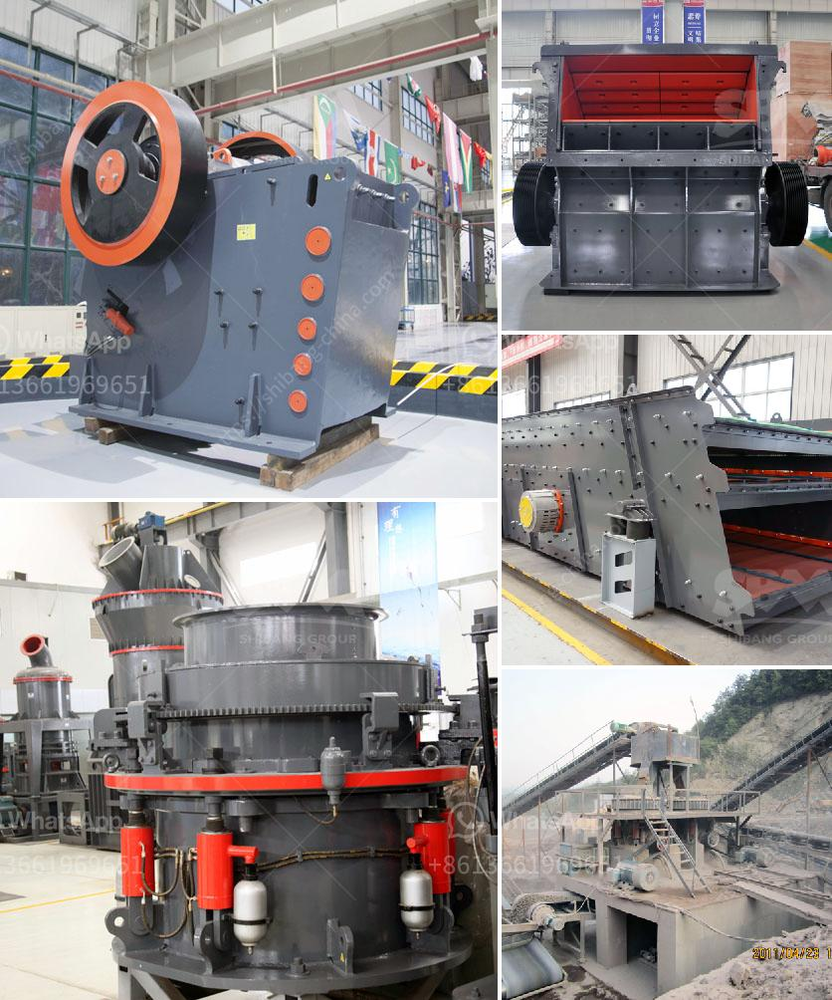

<h3>mini crusher for sale in ireland</h3>
The demand for construction materials is increasing by the day, and Ireland is no exception. To meet this growing demand, many construction companies and individuals are seeking efficient and cost-effective ways to process materials on-site. This is where a mini crusher for sale in Ireland can prove to be a valuable asset.

A mini crusher is a small machine designed to reduce large rocks into smaller rocks, gravel, or rock dust. With its compact size and strong construction, it is widely used in demolition and construction sites. It can crush materials such as concrete, bricks, stones, asphalt, and even reinforced concrete. Moreover, it is capable of producing various sizes of aggregates, which can be reused in construction projects.

One of the key advantages of a mini crusher is its portability and easy transportation. Unlike large crushers, a mini crusher can be easily transported to different job sites within Ireland. This eliminates the need for costly transportation of materials and reduces carbon emissions. It also allows construction companies to process materials on-site rather than sending them to external facilities, thereby saving time and money.

Another significant advantage of a mini crusher is its versatility. It can be used in various applications such as road construction, building foundations, landscaping, and recycling projects. The ability to produce different sizes of aggregates makes it suitable for a wide range of construction projects. Furthermore, the mini crusher can be operated by a single person, making it a cost-effective solution for small-scale construction projects.

In addition to its practical advantages, a mini crusher is also an environmentally friendly option. By crushing and reusing materials on-site, it reduces the need for new materials extraction, thus preserving natural resources. Moreover, it helps in the reduction of landfill waste, as the crushed materials can be used as backfill or recycled for further construction purposes. This contributes to sustainable development and supports Ireland's commitment to a greener future.

When looking for a mini crusher for sale in Ireland, there are several factors to consider. Firstly, it is essential to ensure that the machine is of high quality and built to withstand heavy-duty use. The machine should be durable, reliable, and easy to maintain, ensuring minimum downtime and maximum productivity.

Secondly, it is important to choose a mini crusher that suits the specific requirements of the job. Factors such as the type and size of materials to be crushed, required output size, and operating conditions should be taken into account. Consulting with experts in the field can help in selecting the most suitable machine for the job.

Lastly, it is advisable to choose a mini crusher from a reputable supplier. A reliable supplier will offer a range of options, provide technical support, and ensure prompt after-sales service. They will also provide clear information regarding the machine's specifications, pricing, and warranty, enabling customers to make an informed decision.

In conclusion, a mini crusher for sale in Ireland is a valuable asset for construction companies and individuals seeking efficient and cost-effective ways to process materials. Its portability, versatility, and environmental benefits make it an attractive option. However, it is important to choose a high-quality machine from a reputable supplier that meets specific job requirements. By considering these factors, construction professionals in Ireland can benefit from the advantages offered by a mini crusher.
<h3>Contact us</h3><ul><li><strong>Whatsapp:&nbsp;<a href="https://wa.me/8613661969651">+8613661969651</a></strong></li><li><a href="https://swt.shibang-china.com/?git&amp;zhl&amp;mini crusher for sale in ireland"><strong>Online Service(chat now)</strong></a></li></ul><h3>Related</h3><ul><li><a href='list of cement plant in india.md'>list of cement plant in india</a></li><li><a href='hammer mills hammer mills.md'>hammer mills hammer mills</a></li><li><a href='feldspar stone processing plant.md'>feldspar stone processing plant</a></li><li><a href='crushing and screening plant supplier china.md'>crushing and screening plant supplier china</a></li><li><a href='mobile gold processing 20 tph.md'>mobile gold processing 20 tph</a></li></ul>