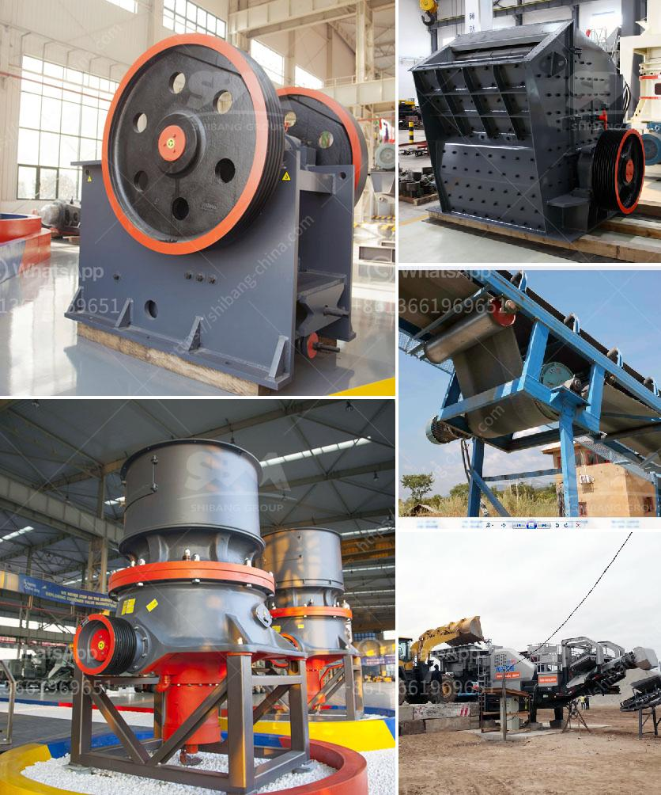

<h3>mini jaw crusher saudi</h3>
Mini jaw crusher Saudi is commonly used as a primary crusher or secondary crusher for a variety of materials in mining, building materials, metallurgy, and so on. Mini jaw crusher Saudi is suitable for crushing small quantities of rock and other friable material, ranging in hardness from hard quartz to relatively soft claystone. This small, compact crusher is designed for maximum versatility and portability.

One of the key advantages of mini jaw crusher Saudi is its simplicity. The crusher is easily operated and maintained, reducing downtime and ensuring efficient operation. It is also compact in size, making it ideal for small-scale mining operations or construction projects where space is limited.

Another advantage of mini jaw crusher Saudi is its high productivity. The crusher has a unique crushing cavity design, which increases the feeding capacity and output. With a smaller inlet size, the crusher can handle smaller raw materials, allowing for higher throughput. This means that more material can be processed in a shorter amount of time, increasing overall productivity.

Additionally, mini jaw crusher Saudi is cost-effective. Its compact design reduces transportation and installation costs, making it an attractive option for small-scale operations. It also consumes less energy compared to larger crushers, resulting in lower operational expenses. Furthermore, the crusher is durable and reliable, with high-quality components that ensure long-term performance.

Mini jaw crusher Saudi can be used for a variety of applications. It is commonly used to reduce the size of large rocks or ore for further processing in a ball mill or hammer mill. It can also be used to break down construction waste and concrete rubble into reusable materials. Additionally, it can crush and recycle old asphalt and bricks, reducing the need for new materials and promoting sustainable practices.

In conclusion, mini jaw crusher Saudi is a versatile and cost-effective solution for small-scale mining operations or construction projects. Its simplicity, high productivity, and compact design make it an attractive option for crushing a variety of materials. With its durability and reliability, mini jaw crusher Saudi offers long-term performance and sustainability. From reducing large rocks to recycling construction waste, this crusher is a valuable tool for any project.
<h3>Contact us</h3><ul><li><strong>Whatsapp:&nbsp;<a href="https://wa.me/8613661969651">+8613661969651</a></strong></li><li><a href="https://swt.shibang-china.com/?git&amp;zhl&amp;mini jaw crusher saudi"><strong>Online Service(chat now)</strong></a></li></ul><h3>Related</h3><ul><li><a href='found stone crusher in davao.md'>found stone crusher in davao</a></li><li><a href='mini sandstone crusher price.md'>mini sandstone crusher price</a></li><li><a href='sand stone quarry mining.md'>sand stone quarry mining</a></li><li><a href='indonesia ball mill manufacturer.md'>indonesia ball mill manufacturer</a></li><li><a href='india conveyor belt for stone crusher.md'>india conveyor belt for stone crusher</a></li></ul>