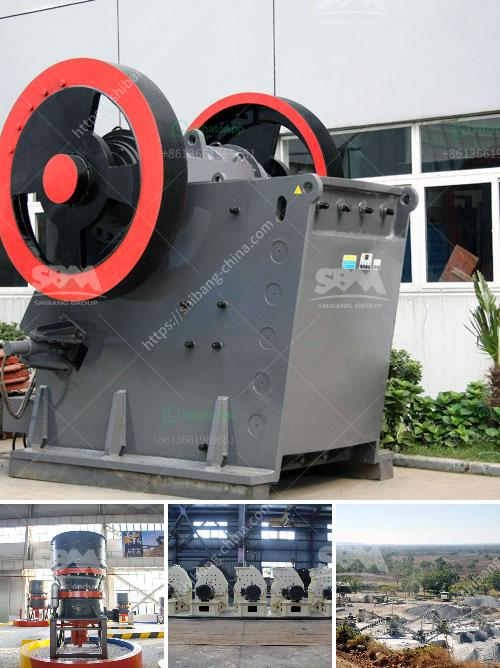

<h3>mini lava rock crusher for homeowner</h3>
As homeowners, we are always on the lookout for tools and equipment that can make our lives easier and more efficient. Whether it be for DIY projects, garden maintenance, or simply improving the overall aesthetic of our homes, having the right tools at our disposal is crucial. One such tool that every homeowner should consider investing in is a mini lava rock crusher. With its versatility and practicality, this compact machine can help transform your lava rocks into usable material, improving the functionality and appearance of your outdoor spaces.

Lava rocks are a natural material commonly used in landscaping and garden design. They offer an array of benefits, such as moisture retention, weed control, and erosion prevention. However, working with large lava rocks can be challenging and time-consuming. This is where a mini lava rock crusher comes in handy.

The mini lava rock crusher, also known as a small jaw crusher, is designed to reduce volcanic rock into small particles. It's an ideal choice for homeowners who want to rejuvenate their outdoor spaces without breaking the bank or hiring professionals. With its compact size and efficient performance, this mini crusher allows homeowners to crush lava rocks effortlessly, enabling easy installation and transformation of their landscapes.

One of the key advantages of using a mini lava rock crusher is its portability. This compact machine can be easily transported and used in various locations around your property. Whether you want to crush lava rocks in your front yard, backyard, or even at a different property, you can take this portable crusher with you wherever you go. Its small size also means it won't take up much space in your garage or shed when not in use.

Another noteworthy feature of a mini lava rock crusher is its simplicity of operation. Designed with the average homeowner in mind, this machine can be easily operated by anyone without any prior experience or technical knowledge. It's user-friendly and doesn't require complicated setup or maintenance. Its straightforward design ensures that crushing lava rocks becomes a hassle-free task for homeowners.

Not only does the mini lava rock crusher make the installation process easier and more efficient, but it also allows for creative design possibilities. By crushing lava rocks into smaller particles, homeowners can create a variety of landscape features such as pathways, borders, and decorative accents. The crushed lava rocks can also be used as a base material for pavers or as a top dressing for gardens, providing a unique and visually appealing touch to your outdoor spaces.

In conclusion, a mini lava rock crusher is a must-have tool for homeowners looking to improve the functionality and aesthetics of their outdoor spaces. Its portability, ease of operation, and versatility make it an ideal companion for any homeowner. By transforming large lava rocks into usable and visually appealing material, this compact machine helps homeowners unleash their creativity and take their landscaping projects to new heights. So, why wait? Invest in a mini lava rock crusher today and witness the transformative power it has on your home's outdoor environment.
<h3>Contact us</h3><ul><li><strong>Whatsapp:&nbsp;<a href="https://wa.me/8613661969651">+8613661969651</a></strong></li><li><a href="https://swt.shibang-china.com/?git&amp;zhl&amp;mini lava rock crusher for homeowner"><strong>Online Service(chat now)</strong></a></li></ul><h3>Related</h3><ul><li><a href='stone crusher permission maharashtra.md'>stone crusher permission maharashtra</a></li><li><a href='desain mesin crusher tempurung kelapa.md'>desain mesin crusher tempurung kelapa</a></li><li><a href='raymond mill manufacturer.md'>raymond mill manufacturer</a></li><li><a href='crushing mill and impact mill.md'>crushing mill and impact mill</a></li><li><a href='production of cement mill in africa.md'>production of cement mill in africa</a></li></ul>