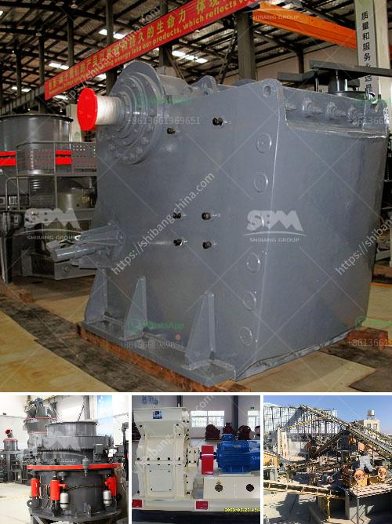

<h3>mini mill 12x20 jaw crusher</h3>
The mini mill 12x20 jaw crusher is a small-sized crushing machine designed for use in laboratories and domestic crushing applications. The mini mill 12x20 jaw crusher features a 12-inch by 20-inch jaw cavity that can reduce large rock sizes to a smaller size, suitable for transporting and processing.

One of the main advantages of this mini mill 12x20 jaw crusher is its simplicity in design and operation. The crushing process is straightforward, as the machine only requires the input of the rock material into the jaw cavity. The crusher's jaws then apply pressure to the rock, breaking it down into smaller pieces. This simple operation makes the mini mill 12x20 jaw crusher suitable for users with limited technical knowledge and expertise.

Another advantage of the mini mill 12x20 jaw crusher is its compact size. The small footprint allows for easy placement and installation in laboratories or domestic settings. It can also be transported to different locations due to its lightweight design. This portability makes the mini mill 12x20 jaw crusher convenient for on-site crushing tasks, such as in construction projects or mining sites with limited space.

Despite its small size, the mini mill 12x20 jaw crusher delivers high performance. The machine is powered by a 7.5 HP electric motor, which enables it to crush rock with ease. Its crushing capacity ranges from 3 to 10 tons per hour, making it suitable for small-scale crushing applications. Whether it is for sample preparation or smaller mining operations, the mini mill 12x20 jaw crusher can effectively handle the workload.

In terms of maintenance, the mini mill 12x20 jaw crusher is designed for easy access to its components. The machine features a hinged access door that allows users to easily inspect and access the inside of the crusher. This accessibility makes maintenance tasks, such as cleaning and lubricating, quick and effortless. Additionally, the wear parts of the crusher, such as the jaws, can be easily replaced when required, ensuring optimal performance and longevity.

Overall, the mini mill 12x20 jaw crusher offers a cost-effective solution for small-scale crushing needs. Its simplicity, compactness, and high performance make it a reliable choice for users looking to crush rocks and minerals efficiently. Whether it is for laboratory testing or domestic applications, this mini mill crusher provides the necessary power and performance to get the job done.
<h3>Contact us</h3><ul><li><strong>Whatsapp:&nbsp;<a href="https://wa.me/8613661969651">+8613661969651</a></strong></li><li><a href="https://swt.shibang-china.com/?git&amp;zhl&amp;mini mill 12x20 jaw crusher"><strong>Online Service(chat now)</strong></a></li></ul><h3>Related</h3><ul><li><a href='crushing mill and impact mill.md'>crushing mill and impact mill</a></li><li><a href='kenya crusher supplier.md'>kenya crusher supplier</a></li><li><a href='crusher plant manufacturer.md'>crusher plant manufacturer</a></li><li><a href='standard ratio for cement sand building blocks.md'>standard ratio for cement sand building blocks</a></li><li><a href='gypsum processing equipment.md'>gypsum processing equipment</a></li></ul>