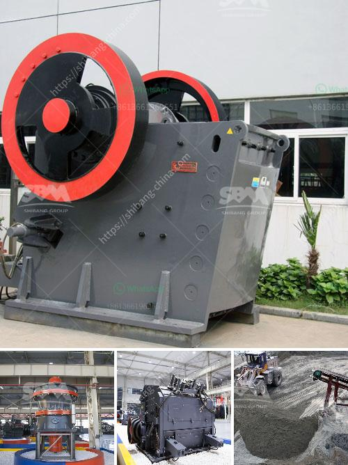

<h3>mini sandstone crusher price</h3>
Sandstone is a sedimentary rock composed mainly of quartz grains. Its size ranges from 2mm to 0.0625mm and its texture varies from coarse to medium grain. Sandstone is an important building material and has been used for centuries in construction due to its durability and aesthetic appeal.

The demand for sandstone in the construction industry has increased rapidly in recent years, leading to a rise in prices. As a result, there has been a growing interest in mini sandstone crushers that are portable and easy to move.

Mini sandstone crushers are used to crush small-sized stones into sand or dust. These machines are designed with a small footprint and can be easily operated and maintained. The price of mini sandstone crushers is based on the model, size, type, and capacity of the machine.

Many mini sandstone crushers are equipped with hoppers, vibratory feeders, and belt conveyors for efficient and continuous crushing of large quantities of sandstone. Once blasted and crushed, the sandstone is screened, washed, and classified into various sizes to meet different construction requirements.

The price of mini sandstone crushers varies greatly depending on the technical parameters and performance. We have developed a range of mini sandstone crushers for sale, including mini jaw crusher, mini impact crusher, mini cone crusher, and mini mobile crusher, which can be customized to meet your needs.

Our mini sandstone crusher has a flexible configuration and not only crushes sandstone, but also various rocks, iron ore, granite, limestone, basalt, and other materials. We provide a comprehensive range of solutions for customers looking for portable and affordable crushing equipment.

In conclusion, mini sandstone crushers are a cost-effective option for construction companies looking to reduce costs and increase productivity. The price of mini sandstone crushers depends on the model, size, type, and capacity, but we offer competitive prices that ensure good value for money. Contact us today to discuss your sandstone crushing needs and get a personalized quote.
<h3>Contact us</h3><ul><li><strong>Whatsapp:&nbsp;<a href="https://wa.me/8613661969651">+8613661969651</a></strong></li><li><a href="https://swt.shibang-china.com/?git&amp;zhl&amp;mini sandstone crusher price"><strong>Online Service(chat now)</strong></a></li></ul><h3>Related</h3><ul><li><a href='used gypsum plant for sale europe.md'>used gypsum plant for sale europe</a></li><li><a href='stone crusher machines.md'>stone crusher machines</a></li><li><a href='vertical grinding machine defination.md'>vertical grinding machine defination</a></li><li><a href='crushing plant application.md'>crushing plant application</a></li><li><a href='crusher manufacturer in pune.md'>crusher manufacturer in pune</a></li></ul>