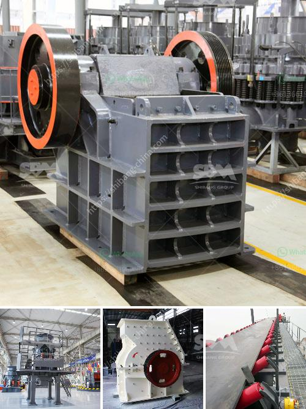

<h3>mining and quarrying machinery and equipment</h3>
Mining and quarrying are essential industries that contribute significantly to the overall development and growth of economies worldwide. These industries rely heavily on machinery and equipment to extract, process, and transport materials such as coal, limestone, limestone, and various ores for further use in construction, manufacturing, and other industries.

Mining and quarrying machinery and equipment play a vital role in maximizing productivity, efficiency, and safety in these industries. These machines are specifically designed to handle the unique challenges associated with mining and quarrying, including tough terrains, harsh weather conditions, and heavy workloads.

One of the most important pieces of equipment used in mining and quarrying operations is the excavator. These large machines are equipped with a powerful hydraulic system and a variety of attachments, such as buckets, rippers, and hydraulic hammers, to efficiently dig and remove soil, rocks, and other materials. Excavators are commonly used to create access roads, clear land, and extract minerals from the earth.

Another crucial tool in these industries is the bulldozer. Bulldozers are heavy-duty machines equipped with a large metal plate called a blade on the front, which is used to push and level soil, rocks, and debris. These machines are mainly used to clear land, create level surfaces, and build and maintain haul roads.

Drilling machines are also essential in mining and quarrying operations. These machines are used to bore holes into the ground to access mineral deposits or extract samples for analysis. Different types of drills, such as rotary and percussion drills, are employed depending on the specific requirements of the project. Advanced drilling technologies have significantly improved the efficiency and accuracy of these machines, reducing costs and time.

Dump trucks are another vital piece of equipment in mining and quarrying operations. These large vehicles are used to transport mined materials, such as coal, ore, and aggregates, from the extraction site to the processing plant or storage facility. Dump trucks come in various sizes and configurations, including rear dump trucks and articulated trucks, to meet the diverse needs of different mining and quarrying operations.

Safety is a paramount concern in the mining and quarrying industries, and specialized equipment is used to ensure the well-being of workers. For example, roof bolters are machines that are used to secure the roofs and walls of underground mines by drilling bolts into the rock. These machines are designed to prevent accidents such as rockfalls and collapses.

In conclusion, mining and quarrying machinery and equipment play a crucial role in the success of these industries. They facilitate the extraction, processing, and transportation of minerals and materials in a safe and efficient manner. The continuous advancements in technology and engineering have resulted in more sophisticated and specialized machines, which have revolutionized the productivity and safety of mining and quarrying operations. As these industries continue to grow and evolve, the demand for reliable and efficient machinery will continue to increase.
<h3>Contact us</h3><ul><li><strong>Whatsapp:&nbsp;<a href="https://wa.me/8613661969651">+8613661969651</a></strong></li><li><a href="https://swt.shibang-china.com/?git&amp;zhl&amp;mining and quarrying machinery and equipment"><strong>Online Service(chat now)</strong></a></li></ul><h3>Related</h3><ul><li><a href='cement manufacturing process flow chart.md'>cement manufacturing process flow chart</a></li><li><a href='stone crusher for sale philippine.md'>stone crusher for sale philippine</a></li><li><a href='small gold crushing plant for sale.md'>small gold crushing plant for sale</a></li><li><a href='stationary jaw crusher.md'>stationary jaw crusher</a></li><li><a href='feldspar crusher impactor.md'>feldspar crusher impactor</a></li></ul>