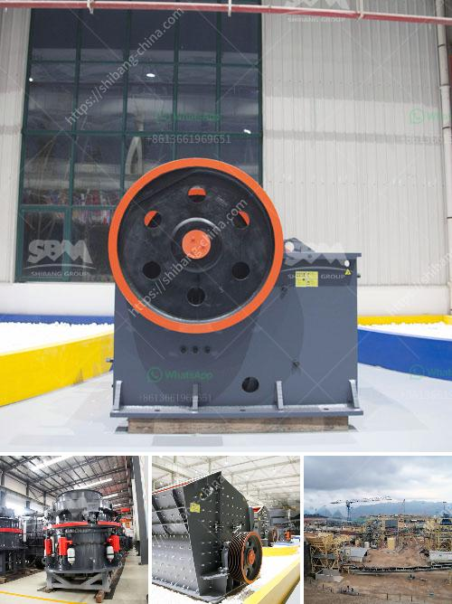

<h3>mining equipment bow mills in zimbabwe</h3>
Zimbabwe is a country known for its rich and diverse mineral resources, with gold being one of its most significant exports. The mining industry plays a crucial role in the country's economic development, providing employment opportunities for thousands of people and contributing to the overall GDP.

Mining equipment such as bow mills are essential for miners in Zimbabwe, as they efficiently extract gold from the ore. These mills are mechanized machines that combine the crushing and grinding processes to reduce the ore into smaller particles.

The primary function of bow mills is to separate gold from other minerals and ores, making it easier to extract and process. The ore is fed into the bow mills, which consist of heavy rotating cylinders containing steel balls. As the cylinders rotate, the balls cascade and crush the ore into a fine powder.

The crushed ore is then mixed with water and chemicals, such as cyanide or mercury, to extract the gold particles. This process, known as amalgamation, helps to separate the gold from the ore. Once the gold particles have been extracted, they are further processed to remove impurities and obtain a purer form of gold.

Bow mills have undergone significant advancements in technology over the years, making them more efficient and sustainable. Many mining companies in Zimbabwe are now using modern bow mill equipment that is more energy-efficient and environmentally friendly.

In addition to their primary role in gold extraction, bow mills are also used in other mining operations, such as copper and nickel mining. These mills can handle a wide range of ores and minerals, making them versatile equipment for various mining applications.

However, despite their importance in the mining industry, bow mills face several challenges in Zimbabwe. One of the major obstacles is the high cost of acquiring and maintaining these equipment. Many small-scale miners cannot afford to invest in bow mills, limiting their ability to increase their gold production.

Furthermore, the availability of spare parts and technical support for bow mills in Zimbabwe is a significant concern. The country relies heavily on imported mining equipment, and the lack of local manufacturing capability makes it difficult to access spare parts and repair services.

The Zimbabwean government has recognized the importance of supporting the mining sector and has taken steps to address these challenges. Initiatives such as the establishment of a dedicated mining equipment manufacturing industry aim to promote local production and reduce reliance on imports.

In conclusion, mining equipment, particularly bow mills, play a vital role in Zimbabwe's mining industry. These machines facilitate efficient gold extraction and contribute to the country's economic development. However, the high cost and limited availability of these equipment pose challenges to small-scale miners. The government's efforts to support the mining sector are crucial in ensuring the sustainability and growth of the industry.
<h3>Contact us</h3><ul><li><strong>Whatsapp:&nbsp;<a href="https://wa.me/8613661969651">+8613661969651</a></strong></li><li><a href="https://swt.shibang-china.com/?git&amp;zhl&amp;mining equipment bow mills in zimbabwe"><strong>Online Service(chat now)</strong></a></li></ul><h3>Related</h3><ul><li><a href='alluvial gold mining project proposal.md'>alluvial gold mining project proposal</a></li><li><a href='crusher mobile crusher peru.md'>crusher mobile crusher peru</a></li><li><a href='stone crushets for sale south aftica.md'>stone crushets for sale south aftica</a></li><li><a href='mobile crusher price list.md'>mobile crusher price list</a></li><li><a href='rock pulverizer for manufacturing.md'>rock pulverizer for manufacturing</a></li></ul>