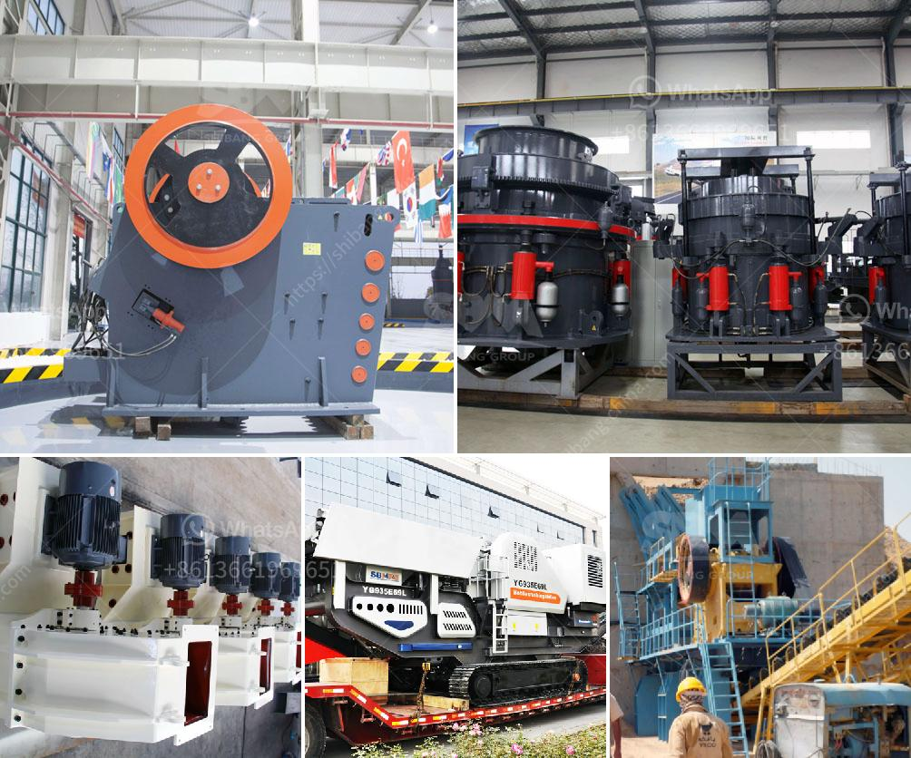

<h3>mining heavy equipment price list</h3>
Mining is a crucial industry that plays a pivotal role in the economic development of nations. It involves extracting valuable minerals and resources from the earth's surface or underground. Mining heavy equipment is essential for the success of mining operations and to ensure safety and efficiency in the process. However, the price of this equipment can vary significantly depending on various factors.

One of the key factors that determine the price of mining heavy equipment is the type of equipment required. There are several types of equipment used in mining, including excavators, bulldozers, dump trucks, loaders, and drills, among others. Each type of equipment has different functionalities and specifications, resulting in variations in prices.

Another factor that influences the price of mining heavy equipment is the brand and manufacturer. Established brands with a solid reputation in the mining industry often command higher prices due to their reliability, durability, and advanced technological features. These brands invest heavily in research and development to create cutting-edge equipment that meets the demanding requirements of mining operations.

Moreover, another crucial factor affecting the price of mining heavy equipment is the capacity or size of the equipment. Larger equipment with higher capacity is generally more expensive as it can handle larger quantities of materials and have more powerful engines. Additionally, equipment with advanced features such as autonomous operation or remote control capabilities tends to have a higher price tag.

Furthermore, the condition of the equipment also impacts its price. New mining equipment is typically more expensive as it is in pristine condition and comes with warranties and after-sales support. However, used or refurbished equipment can provide a cost-effective alternative for mining companies operating on a limited budget. These used machines are often sold at a lower price but must be carefully inspected to ensure they are in good working condition.

Additionally, the mining heavy equipment price list can be influenced by market demand and supply dynamics. During periods of high demand, such as a mining boom, equipment prices tend to surge due to increased competition among mining companies. Conversely, during periods of economic downturn or decreased mining activity, prices may decrease as manufacturers offer discounts to stimulate sales.

In conclusion, the price of mining heavy equipment can vary significantly depending on various factors including the type of equipment, brand and manufacturer, capacity, condition, and market dynamics. Mining companies should carefully consider their operational requirements and budget constraints to choose the most suitable equipment that offers a balance between quality and cost-effectiveness. Investing in reliable and efficient mining heavy equipment is crucial for the success and profitability of mining operations in the long run.
<h3>Contact us</h3><ul><li><strong>Whatsapp:&nbsp;<a href="https://wa.me/8613661969651">+8613661969651</a></strong></li><li><a href="https://swt.shibang-china.com/?git&amp;zhl&amp;mining heavy equipment price list"><strong>Online Service(chat now)</strong></a></li></ul><h3>Related</h3><ul><li><a href='machinery used in cement factory.md'>machinery used in cement factory</a></li><li><a href='slag grindimg in ball mill.md'>slag grindimg in ball mill</a></li><li><a href='crush granite machine.md'>crush granite machine</a></li><li><a href='rolls crusher for sale.md'>rolls crusher for sale</a></li><li><a href='india conveyor belt for stone crusher.md'>india conveyor belt for stone crusher</a></li></ul>