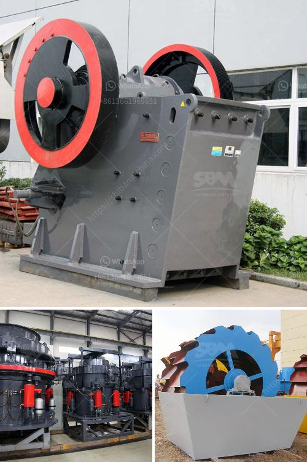

<h3>mining of granite companies</h3>
Granite, with its distinct patterns and durability, has been a popular choice for centuries in construction and interior design. The mining industry plays a crucial role in extracting this beautiful natural stone from quarries worldwide. In this article, we will delve into the world of mining of granite companies, exploring their processes, challenges, and contributions to the global market.

Granite mining involves extracting granite deposits from the earth's crust using various techniques. These techniques can be categorized into two primary methods: quarrying and mining.

Quarrying is the most common method used by granite mining companies. It involves cutting into the earth's crust to access the granite deposits. Quarrying utilizes drilling, cutting, and blasting processes to extract large blocks of granite. Explosives are commonly used to break the stone, which is then transported to the processing plants for further refinement.

Mining is another method employed by granite mining companies, though less frequently used. It involves extracting the stone by creating tunnels or shafts deep into the earth's crust. Mining is usually chosen when the granite deposits are located deep below the surface and are inaccessible through quarrying alone.

Once extracted, the granite blocks undergo several processes before they become market-ready. The first step is cutting the blocks into slabs, which can be done manually or using cutting machinery. The slabs are then polished to achieve a smooth and glossy finish, enhancing the stone's natural beauty.

Granite mining companies face numerous challenges, including environmental concerns, safety regulations, and fluctuating market demands. Environmental sustainability has become a significant focus in recent years, with companies implementing practices to minimize their impact on nature. These practices include reforestation, water conservation, and responsible waste management.

Safety regulations are essential in granite mining, as accidents and injuries can occur due to heavy machinery, explosives, and unstable structures. Mining companies prioritize the safety of their workers, providing training, protective gear, and adhering to strict protocols to minimize risks.

Market demands can be unpredictable, with fluctuations in both domestic and international markets. Granite mining companies need to stay updated about the latest trends and preferences of architects, designers, and consumers to meet market demands effectively.

The mining of granite companies has a significant impact on the global stone market. They not only provide an essential natural resource but also contribute to the economy by generating employment opportunities and revenue. Granite is an exportable commodity, and many countries heavily rely on its mining industry to boost their economies.

Moreover, granite mining companies play a vital role in shaping the infrastructure landscape of nations. From monuments and statues to buildings and bridges, granite is a popular choice due to its durability, versatility, and aesthetic appeal. These companies ensure a consistent supply of high-quality granite, contributing to the development of architectural wonders worldwide.

In conclusion, the mining of granite companies is a crucial aspect of the stone industry. Through quarrying and mining techniques, these companies extract granite deposits and process them into market-ready slabs. Despite facing challenges such as environmental concerns and fluctuating market demands, they contribute significantly to the global stone market, economy, and infrastructure development. The mining of granite companies shapes the world we live in, providing us with the timeless beauty of this remarkable natural stone.
<h3>Contact us</h3><ul><li><strong>Whatsapp:&nbsp;<a href="https://wa.me/8613661969651">+8613661969651</a></strong></li><li><a href="https://swt.shibang-china.com/?git&amp;zhl&amp;mining of granite companies"><strong>Online Service(chat now)</strong></a></li></ul><h3>Related</h3><ul><li><a href='beneficiation of iron ore suppliers.md'>beneficiation of iron ore suppliers</a></li><li><a href='prices of conveyor belts for mining.md'>prices of conveyor belts for mining</a></li><li><a href='stone crusher flow chart.md'>stone crusher flow chart</a></li><li><a href='gypsum crusher specification.md'>gypsum crusher specification</a></li><li><a href='coal mine conveyor belt for sale.md'>coal mine conveyor belt for sale</a></li></ul>