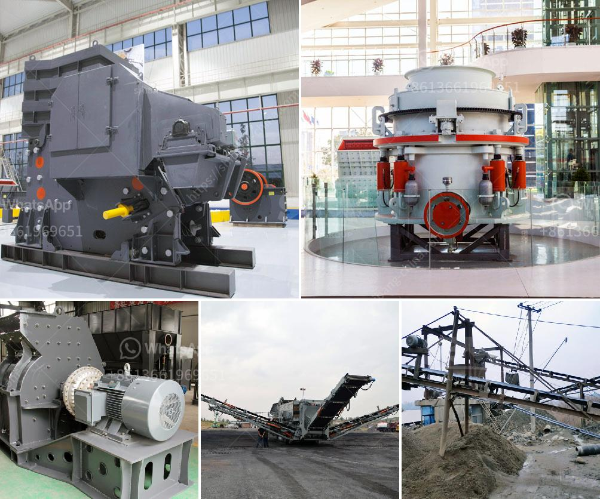

<h3>mining procedure in zambia</h3>
Zambia, located in southern Africa, is renowned for its vast mineral resources, with copper being the most prominent. The nation's mining sector has played a pivotal role in shaping its economy, contributing significantly to foreign exchange earnings and employment opportunities for many citizens. Understanding the mining procedure in Zambia is essential in comprehending the complexities and significance of this industry in the country's development.

The first step in the mining procedure in Zambia involves exploration activities to identify potential mineral deposits. Geologists employ various methods, including aerial surveys, satellite imagery, and ground-based sampling, to investigate the geological characteristics of specific areas. Once a potential site is identified, exploration teams conduct detailed assessments to estimate the size, quality, and economic viability of the mineral deposits.

Before any mining activities can begin, mining companies must secure appropriate licenses and permits from the relevant government authorities. These licenses regulate aspects such as mineral rights, environmental compliance, safety standards, and the obligation to contribute to the local community's social development.

Once the necessary permits are obtained, mining companies proceed with preparing the site for mining operations. This includes clearing vegetation, constructing access roads, and establishing basic infrastructure such as power supply and water sources. Depending on the size and nature of the deposit, companies may also need to build camps for housing their workforce.

Furthermore, they must develop mine plans that detail the extraction methods, waste management, and safety procedures to be implemented. Comprehensive environmental impact assessments are conducted to ensure the mitigation of potential ecological damage during mining operations.

The extraction of minerals in Zambia primarily involves open-pit or underground mining methods, depending on the type and depth of the deposit. Open-pit mining is used for minerals located close to the surface, while underground mining is employed when the minerals lie deep within the earth.

During open-pit mining, large machinery, such as earthmovers and excavators, is used to remove overburden (the overlaying rock and soil) to expose the mineralized ores. These ores are then blasted with explosives to facilitate the extraction process. Subsequently, the minerals are transported to a processing plant for further treatment.

Underground mining, on the other hand, necessitates the construction of tunnels and shafts to access the desired minerals. Miners use specialized equipment to extract the ores and transport them to the surface for processing. Underground mining requires extensive safety measures, given the inherent risks associated with working in confined spaces and underground conditions.

After extraction, the mineral ores are taken to processing plants for further refinement. Copper, which is Zambia's primary mining resource, undergoes various processes, including crushing, milling, flotation, smelting, and refining, to produce the final product – copper cathodes.

The resulting copper cathodes are then exported for use in different industries, including electrical wiring, construction materials, and telecommunications equipment.

The Zambian government plays a crucial role in regulating and overseeing the mining procedure to protect miners' welfare, promote environmental sustainability, and ensure the equitable distribution of mining revenues. The government levies taxes and royalties on mining companies, which contribute to national revenues and fund essential public services and infrastructure projects.

In conclusion, the mining procedure in Zambia involves a comprehensive process from exploration to extraction, processing, and refinement. Mining companies operating in the country must adhere to stringent regulations and environmental standards enforced by the government. As the nation's copper resources continue to contribute to its economic growth, the sustainable management and responsible extraction of minerals in Zambia will play a pivotal role in its future development.
<h3>Contact us</h3><ul><li><strong>Whatsapp:&nbsp;<a href="https://wa.me/8613661969651">+8613661969651</a></strong></li><li><a href="https://swt.shibang-china.com/?git&amp;zhl&amp;mining procedure in zambia"><strong>Online Service(chat now)</strong></a></li></ul><h3>Related</h3><ul><li><a href='mini sandstone crusher price.md'>mini sandstone crusher price</a></li><li><a href='quarry plant equipments and costs.md'>quarry plant equipments and costs</a></li><li><a href='how to build a hammer mill.md'>how to build a hammer mill</a></li><li><a href='south africa second hand mobile stone crusher.md'>south africa second hand mobile stone crusher</a></li><li><a href='gypsum crusher machine turkey.md'>gypsum crusher machine turkey</a></li></ul>