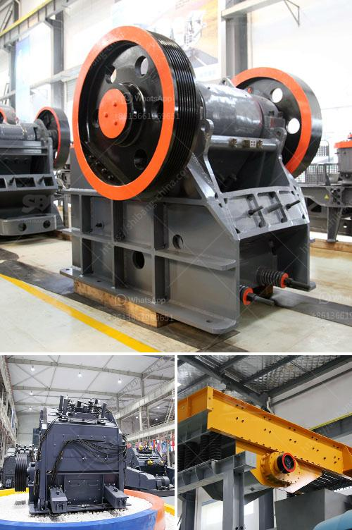

<h3>mining process of basalt crusher</h3>
Basalt is a common extrusive volcanic rock. It is usually grey to black and fine-grained due to rapid cooling of lava at the surface of a planet. Basalt is an important rock because it can form from various volcanic eruptions, including those that occur on the ocean floor. Basalt has a variety of uses, including as a construction material, in road building, and as a raw material for making cast stone.

The mining process of basalt crusher starts with the extraction. Raw materials from the mine are first crushed using jaw crushers and cone crushers. The crushed particles are then mixed with sand, water, and other materials to form a slurry. This slurry is then pumped into a flotation cell, where the minerals are separated from the waste material and concentrated into a product.

Once the basalt minerals are separated from the waste material, they are transported to a crusher plant. The crusher plant is usually located near the mining site and is used to reduce the size of the basalt rocks. The crusher plant contains different kinds of crushers, including jaw crushers, cone crushers, and impact crushers.

After the basalt rocks are crushed, they are sent to a vibrating screen. This screen separates the larger-sized rocks from the smaller ones. The smaller rocks are then sent to a conveyor belt, which transports them to a storage bin.

Once the basalt rocks are stored in the bin, they can be used for various purposes. One of the main uses of basalt is as a construction material. It is commonly used in the construction of roads, bridges, and buildings. Basalt is also used as a raw material for making cast stone, which is used for architectural purposes.

The mining process of basalt crusher is not only beneficial for the mining companies but also for the environment. Since the basalt rocks are extracted from the earth, they can be reused and recycled. This reduces the need for new materials to be extracted, which can lead to environmental degradation.

In conclusion, the mining process of basalt crusher involves the extraction, crushing, and storage of basalt rocks. The extracted basalt rocks are crushed into smaller sizes, which are then transported to a crusher plant. The crushed basalt rocks are then separated and stored for various purposes, such as construction and making cast stone. The mining process of basalt crusher is not only beneficial for the mining companies but also for the environment, as it promotes recycling and reduces the need for new materials to be extracted.
<h3>Contact us</h3><ul><li><strong>Whatsapp:&nbsp;<a href="https://wa.me/8613661969651">+8613661969651</a></strong></li><li><a href="https://swt.shibang-china.com/?git&amp;zhl&amp;mining process of basalt crusher"><strong>Online Service(chat now)</strong></a></li></ul><h3>Related</h3><ul><li><a href='grinding mill spare parts manufacturers china.md'>grinding mill spare parts manufacturers china</a></li><li><a href='grinding lm vertical mill.md'>grinding lm vertical mill</a></li><li><a href='roll ball mill manufacturers.md'>roll ball mill manufacturers</a></li><li><a href='crusher in hialeah sale.md'>crusher in hialeah sale</a></li><li><a href='crushing machine manufacturer.md'>crushing machine manufacturer</a></li></ul>