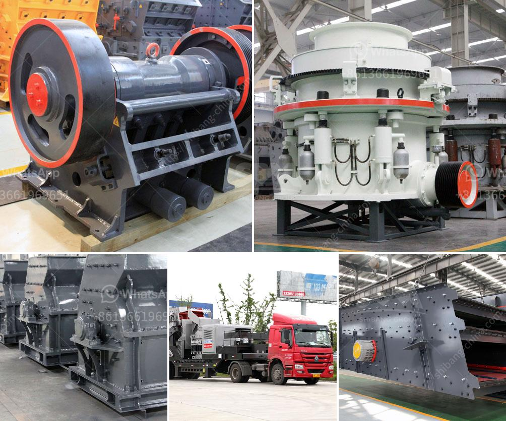

<h3>mining process of limestone</h3>
Limestone has been a valuable resource for centuries, used extensively in the construction of buildings, roads, and other infrastructure. Today, limestone is extracted through a variety of methods, from simple quarrying to more complex underground mining processes.

Limestone deposits are found throughout the world and are often mined in shallow quarries or opencast mines. These operations involve the extraction of limestone from the earth's crust followed by processing and refining the stone into materials suitable for a range of applications.

Quarrying is the most common method used, whereby layers of rock are removed by drilling and blasting to access the limestone beneath. Large machinery, such as bulldozers and front-end loaders, are then used to lift and transport the limestone to the processing plant.

Once at the plant, the limestone undergoes various stages of crushing, screening, and washing to produce the desired size and quality of aggregate. Additional processes such as calcining and hydrating may also be employed to transform limestone into lime or slaked lime, which are used in industrial applications such as steel production and water treatment.

In some cases, limestone is mined by underground methods, typically carried out when the deposit is too deep or the quality of the stone is low. This process involves creating tunnels and chambers in the rock using a combination of drilling, blasting, and cutting techniques. The extracted limestone is then brought to the surface using conveyor belts or mine carts for further processing.

Mining limestone is not without environmental impacts, as the extraction process often leads to the destruction of natural habitats and the pollution of air and water. However, modern mining techniques have significantly reduced these impacts through measures such as land restoration and the use of water and dust suppression systems.

In conclusion, the mining process of limestone involves extracting the stone from the earth, processing it in a plant, and transforming it into various products for industrial use. Despite its environmental impacts, limestone mining is a vital industry that contributes to the construction and infrastructure development of societies worldwide. With increased emphasis on sustainability, the industry continues to innovate and implement measures to minimize its environmental footprint.
<h3>Contact us</h3><ul><li><strong>Whatsapp:&nbsp;<a href="https://wa.me/8613661969651">+8613661969651</a></strong></li><li><a href="https://swt.shibang-china.com/?git&amp;zhl&amp;mining process of limestone"><strong>Online Service(chat now)</strong></a></li></ul><h3>Related</h3><ul><li><a href='stone crushers in bangalore.md'>stone crushers in bangalore</a></li><li><a href='jaw crusher for sale in south africa.md'>jaw crusher for sale in south africa</a></li><li><a href='capital requirement for one ton cement mill.md'>capital requirement for one ton cement mill</a></li><li><a href='roller mill in india.md'>roller mill in india</a></li><li><a href='ballast processing.md'>ballast processing</a></li></ul>