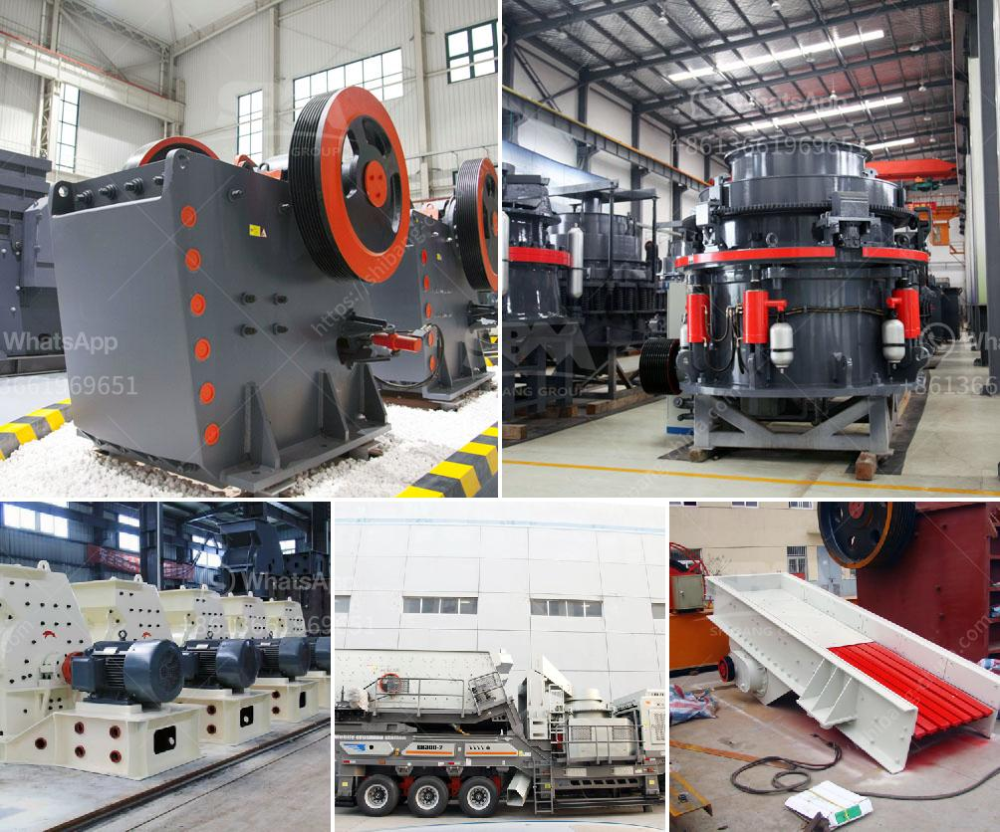

<h3>mm granite stone jaw crusher</h3>
MM granite stone jaw crusher is one of the most widely used crushers in industrial production. It is primarily used for crushing various materials with compressive strength not exceeding 320 MPa, such as granite, limestone, river pebble, iron ore, etc. It can be applied in mining, metallurgy, construction, highway, railway, water conservancy and chemical industries.

The jaw crusher is a large machine that has a stationary plate and moves a movable plate. This crushing action causes the stones to break along their natural cleavage lines, resulting in a more cubical product, which is desirable for many industrial applications. Additionally, the deep crushing chamber and large gape width ensure excellent crushing performance.

One of the key advantages of the MM granite stone jaw crusher is its high efficiency and low operating cost. With a large crushing ratio and optimized design, it consumes less energy and generates less dust. This not only saves money on energy bills but also promotes a clean and environmentally friendly working environment.

Furthermore, the jaw crusher is equipped with a high-quality and durable jaw plate that ensures reliable operation and long service life. The manganese steel construction provides excellent wear resistance, which reduces the frequency of maintenance and replacement, thus minimizing downtime and increasing productivity.

The MM granite stone jaw crusher also features a convenient discharge adjustment mechanism. By adjusting the gap between the two plates, users can control the final product size, ensuring the desired specifications for different projects. This flexibility makes it suitable for a wide range of applications and increases its overall practicality.

In conclusion, the MM granite stone jaw crusher is a versatile and durable machine that has proven to be a valuable asset in various industries. Its high efficiency, low operating cost, and reliable performance make it a preferred choice among customers. Whether in mining, construction, or any other field, this jaw crusher excels at crushing granite and other hard materials, providing high-quality aggregates for further processing.
<h3>Contact us</h3><ul><li><strong>Whatsapp:&nbsp;<a href="https://wa.me/8613661969651">+8613661969651</a></strong></li><li><a href="https://swt.shibang-china.com/?git&amp;zhl&amp;mm granite stone jaw crusher"><strong>Online Service(chat now)</strong></a></li></ul><h3>Related</h3><ul><li><a href='copper gold processing plant.md'>copper gold processing plant</a></li><li><a href='stone crushers for sale in riyadh.md'>stone crushers for sale in riyadh</a></li><li><a href='mini jaw crusher saudi.md'>mini jaw crusher saudi</a></li><li><a href='sand washing plant suppliers.md'>sand washing plant suppliers</a></li><li><a href='quarries crusher in nigeria.md'>quarries crusher in nigeria</a></li></ul>