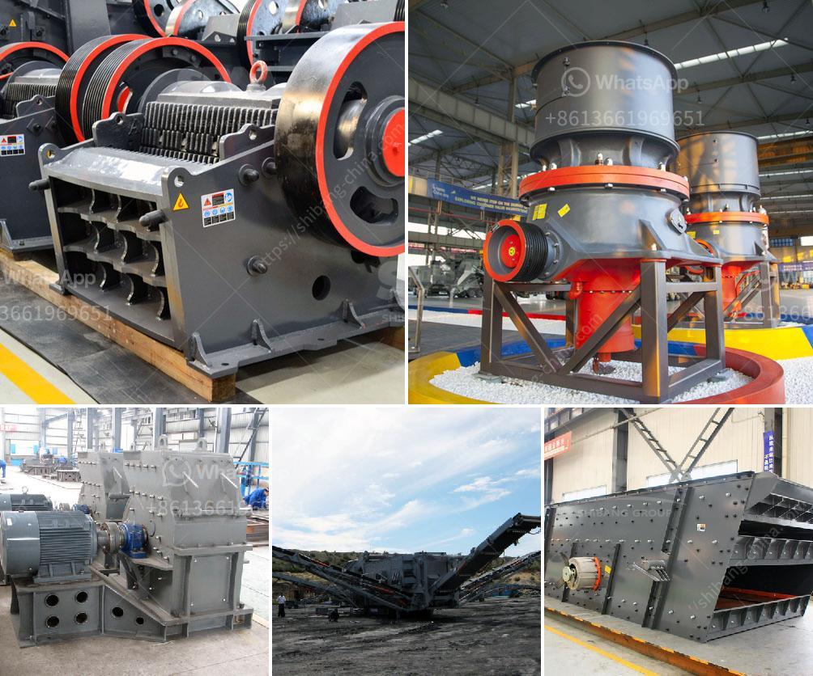

<h3>mobile clusher for hire tanzania</h3>
In recent years, Tanzania has witnessed impressive growth in its construction industry. With numerous infrastructure projects underway, there is a high demand for quality aggregates and materials to meet the growing needs of the sector. However, traditional methods of aggregate production and transportation can be time-consuming and cost-intensive, hampering the overall efficiency of construction projects. This is where mobile crushers for hire come into play, providing a convenient and efficient solution for the industry.

A mobile crusher is a machine designed to reduce large rocks into smaller rocks, gravel, or rock dust. It uses forceful compression to break rocks down into a smaller size, allowing for easier handling and transportation. These machines are mounted on tracks or wheels, giving them mobility and flexibility to move around various construction sites. Mobile crushers are commonly used in mining, quarrying, and recycling applications, where they can process aggregates, concrete, asphalt, and other construction materials on-site.

The concept of hiring mobile crushers is becoming increasingly popular in Tanzania due to its numerous advantages. Firstly, mobile crushers enable contractors to process materials directly at the construction site, eliminating the need to transport heavy loads of aggregates from distant quarries. This significantly reduces logistics costs, fuel consumption, and carbon emissions, contributing to a more sustainable and eco-friendly approach to construction.

Moreover, the use of mobile crushers enhances the overall efficiency of construction projects. By acquiring a mobile crusher for hire, contractors can crush and screen materials on-demand, precisely when and where they are needed. This eliminates delays caused by waiting for materials to be delivered and enables faster project completion. Additionally, mobile crushers can produce a wide range of aggregate sizes, ensuring the availability of tailor-made materials for specific project requirements.

Another major advantage of using mobile crushers for hire is their versatility. These machines are designed to handle a variety of materials, ranging from natural rocks to demolition waste. Thanks to their adjustable settings, mobile crushers can produce different sizes of aggregates and adjust the gradation of the final product, making them suitable for a wide range of construction applications. Whether it's road construction, building foundations, or landscaping projects, a mobile crusher can cater to diverse needs.

Furthermore, by hiring a mobile crusher, project managers can allocate resources more efficiently. Since the cost of purchasing, maintaining, and operating a mobile crusher can be substantial, hiring one becomes a cost-effective solution. This allows contractors to access cutting-edge technology without committing to long-term investments. Additionally, mobile crusher hire services often include skilled operators with expertise in operating and maintaining the machinery, ensuring optimal performance and productivity.

In conclusion, the growing demand for quality aggregates in Tanzania's construction industry has stimulated the need for efficient and cost-effective solutions. Hiring a mobile crusher provides a convenient and flexible approach to aggregate processing, reducing transportation costs, and enhancing project efficiency. By leveraging the benefits of mobile crushers, Tanzanian contractors can tackle construction projects with greater ease, efficiency, and sustainability.
<h3>Contact us</h3><ul><li><strong>Whatsapp:&nbsp;<a href="https://wa.me/8613661969651">+8613661969651</a></strong></li><li><a href="https://swt.shibang-china.com/?git&amp;zhl&amp;mobile clusher for hire tanzania"><strong>Online Service(chat now)</strong></a></li></ul><h3>Related</h3><ul><li><a href='mobile crusher for sale sri lanka stone crusher machine.md'>mobile crusher for sale sri lanka stone crusher machine</a></li><li><a href='crushed calcite manufacturer in rajasthan.md'>crushed calcite manufacturer in rajasthan</a></li><li><a href='mini crusher for sale in ireland.md'>mini crusher for sale in ireland</a></li><li><a href='complete scm stone crushing plant.md'>complete scm stone crushing plant</a></li><li><a href='stone crusher for sale gumtree.md'>stone crusher for sale gumtree</a></li></ul>