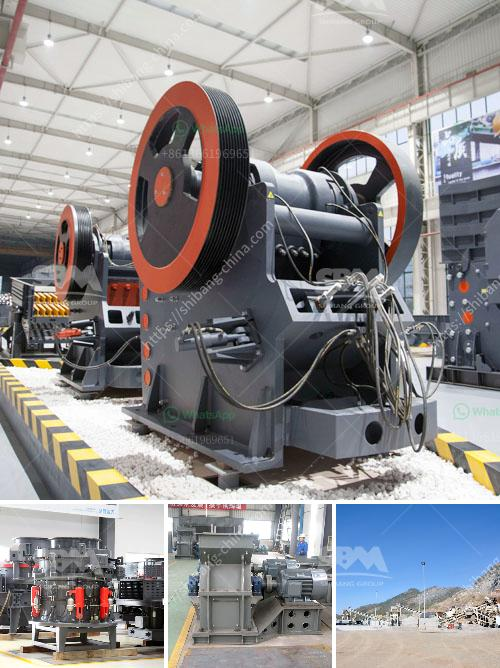

<h3>mobile cone crusher hire malaysia</h3>
Mobile cone crusher hire malaysia is suitable for secondary and tertiary crushing in direct feed applications. It is available in different specifications to meet the diverse needs of customers. It has a compact structure and is easy to move. Besides, it is designed with hydraulic adjustment and automatic protection to ensure the high efficiency and safety of operation.

In Malaysia, mobile cone crusher hire is also widely used in iron ore mining, construction waste recycling, and other industries. Although there are many crushers for hire, available in the market, the most common ones are cone crushers and jaw crushers. These two types of mobile crushers are commonly used in construction and mining businesses. As for the differences between them, the following aspects may be helpful to you.

Firstly, the structure of the mobile cone crusher is relatively compact, which belongs to a simpler mobile crusher. It can be easily moved on the roads or rough terrains, saving transportation cost and reducing the setup time. On the other hand, the mobile jaw crusher is more suitable for the hard rock crushing and is widely used in open-pit mining, quarrying, construction, road construction, etc.

Secondly, the mobile cone crusher has excellent performance in medium crushing; it is highly efficient, easy to operate, and reduces the maintenance cost. In contrast, the mobile jaw crusher plant is used for coarse crushing and usually used in primary crushing process. Mobile crushers offer the advantage of being able to move onto the job site quickly and easily. There are many types of mobile crushers, such as mobile jaw crushers, mobile cone crushers, mobile gyratory crushers, etc. They can be used in different production situations according to the production requirements.

Thirdly, the mobile cone crusher hires in Malaysia are classified into the feed hopper, the crusher itself, the return conveyor, and the discharge conveyor. As a whole, the mobile cone crusher plant is easy to move and transport, so that it can work efficiently even when driven off the truck. This makes it a great investment for businesses as it enables on-site crushing where needed.

In conclusion, mobile cone crusher hire in Malaysia is suitable for almost all of the common types of rocks and applications such as iron ore, limestone, granite, basalt, limestone, quartzite, and sandstone. It is also known as portable cone crusher or portable cone crushing plant. Tracked Cone Crusher Plant can be integrated with primary crushing or multi-stage crushing and screening. It is often used in secondary or tertiary crushing stage in mining, quarrying, and recycling applications. These portable cone crusher is widely used in granite, limestone, basalt, etc. And they are widely used in the construction of roads, railways, water conservancy, and so on.

Overall, mobile cone crusher hire malaysia is a cost-effective solution for businesses in the industry. As it can be easily transported, it can save you a lot of time and money. Plus, it allows you to improve productivity, increase efficiency, and reduce maintenance costs. Therefore, mobile cone crusher hire Malaysia is an excellent choice for any construction company or contractor who needs a high-quality and efficient crushing plant.
<h3>Contact us</h3><ul><li><strong>Whatsapp:&nbsp;<a href="https://wa.me/8613661969651">+8613661969651</a></strong></li><li><a href="https://swt.shibang-china.com/?git&amp;zhl&amp;mobile cone crusher hire malaysia"><strong>Online Service(chat now)</strong></a></li></ul><h3>Related</h3><ul><li><a href='construction waste recycling production line.md'>construction waste recycling production line</a></li><li><a href='ball mill in egypt.md'>ball mill in egypt</a></li><li><a href='copper ore concentration plant supplier.md'>copper ore concentration plant supplier</a></li><li><a href='limestone rock crushing company.md'>limestone rock crushing company</a></li><li><a href='crushing and screening contractors in gauteng.md'>crushing and screening contractors in gauteng</a></li></ul>