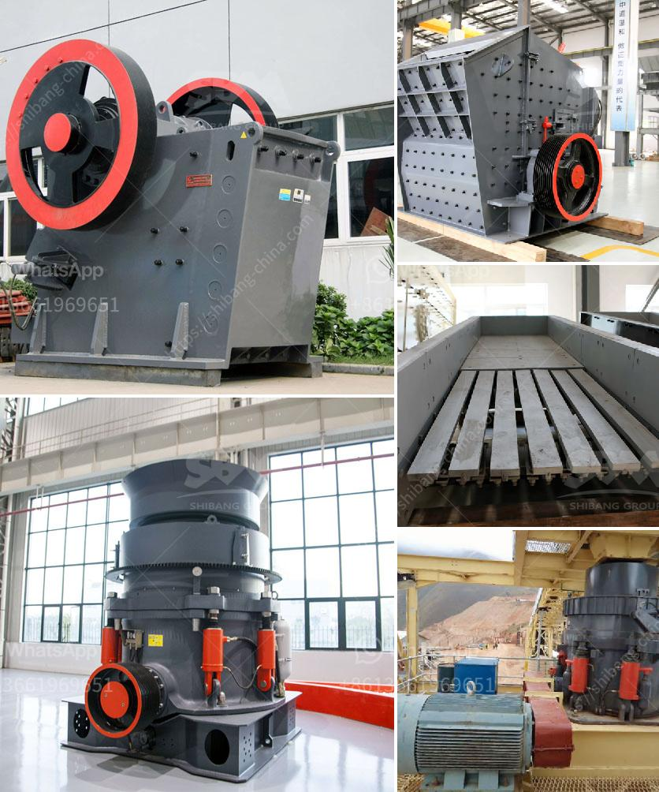

<h3>mobile crusher 100tph for sale</h3>
In recent years, the demand for mobile crushers has been increasing steadily due to their flexibility, mobility, and efficiency. With the goal of improving the overall productivity, more and more construction companies are opting for mobile crushing plants. Among them, the 100tph mobile crusher is gaining popularity due to its low cost, long lifespan, and high efficiency. This article will explore the advantages of mobile crusher 100tph for sale in detail.

One of the key benefits of mobile crushers is their enhanced mobility, allowing them to be easily moved from one location to another. This flexibility ensures quick site transitions and significantly reduces transportation costs, as there is no need for additional equipment or vehicles. The 100tph mobile crusher offers maximum mobility and can be operated even in harsh terrains, enabling contractors to access remote areas with ease.

The 100tph mobile crusher eliminates the cumbersome steel frame structure and foundation construction during the crushing process, saving a lot of time. It can be driven to the site directly, saving transportation costs, effectively reducing overhead expenses. Additionally, the compact design of the mobile crusher ensures efficient use of fuel, thereby reducing operational costs.

The mobile crusher 100tph for sale can be used in a wide range of applications, depending on the specific requirements of the project. For instance, it can be used as a primary crushing unit to produce final end products or as a secondary crusher to produce aggregates for road construction or paving. The versatility of the mobile crusher makes it ideal for various crushing operations.

Thanks to its powerful crushing capacity, the 100tph mobile crusher can process even the hardest rock, ensuring its high productivity. Compared to fixed crushers, the mobile crusher provides a quicker and more efficient crushing operation, reducing the processing time by up to 30% while increasing overall capacity.

With growing concerns about carbon emissions and environmental preservation, the mobile crusher 100tph for sale comes with an eco-friendly design. It is equipped with a dust suppression system that significantly reduces dust and noise emissions. This feature makes it an acceptable choice for construction projects near residential areas or environmentally sensitive sites.

The mobile crusher 100tph for sale provides an efficient and versatile solution for medium-hard to hard stones and materials. Its compact structure, advanced design, and excellent performance are impressive, making it stand out in the market. The enhanced mobility and cost-effective operational advantages make it a preferred choice for contractors worldwide. By investing in a 100tph mobile crusher, construction companies can ensure improved productivity, reduced costs, and enhanced environmental efficiency, making it a wise choice for future construction projects.
<h3>Contact us</h3><ul><li><strong>Whatsapp:&nbsp;<a href="https://wa.me/8613661969651">+8613661969651</a></strong></li><li><a href="https://swt.shibang-china.com/?git&amp;zhl&amp;mobile crusher 100tph for sale"><strong>Online Service(chat now)</strong></a></li></ul><h3>Related</h3><ul><li><a href='conveyor belt manufacturer in uae.md'>conveyor belt manufacturer in uae</a></li><li><a href='mobile crusher medium manufacturers japan.md'>mobile crusher medium manufacturers japan</a></li><li><a href='financial projection of a quarry business.md'>financial projection of a quarry business</a></li><li><a href='mobile crusher made in turkey.md'>mobile crusher made in turkey</a></li><li><a href='mica processing machinery pictures.md'>mica processing machinery pictures</a></li></ul>