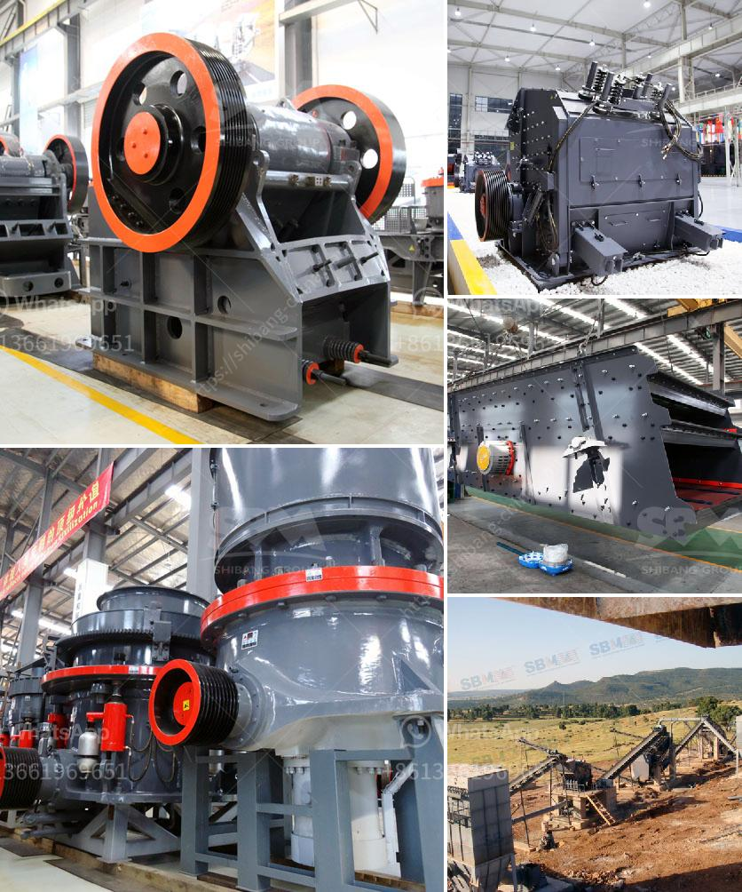

<h3>mobile crusher for sale sri lanka stone crusher machine</h3>
Mobile Crusher For Sale Sri Lanka Stone Crusher Machine is a machine that crushes large rocks into smaller pieces, making it easier to transport and easier to work with for construction purposes. Mobile crushers can be incredibly useful for those working in remote areas, where hauling large stones and rocks is not an option. They are also beneficial for construction companies that need to crush materials on-site and save on transportation costs.

In Sri Lanka, mobile crushers are commonly used in the construction industry as they can provide large quantities of material in a short amount of time. The ability to crush materials on-site eliminates the need to transport materials from the quarry to the construction site, saving time and money. These machines are also versatile and can be used for a variety of applications, such as road construction, building demolition, and clearing land.

One of the main advantages of using a mobile crusher in Sri Lanka is its flexibility. These machines can be easily transported to different locations, allowing contractors to easily move them from one project to another. This eliminates the need for multiple machines and reduces equipment costs. Furthermore, mobile crushers can be set up quickly, allowing for immediate use and increased productivity.

Another benefit of using a mobile crusher is its ability to produce a wide range of materials. These machines can crush various types of rocks and stones, including limestone, granite, and concrete. This versatility allows contractors to produce different types of materials for different construction projects. For example, crushed limestone can be used as a base material for roads, while crushed concrete can be used as a fill material or for making new concrete.

In conclusion, mobile crushers are a valuable asset for the construction industry in Sri Lanka. They provide contractors with a cost-effective and efficient way to crush large rocks and stones on-site, saving time and money on transportation. Additionally, their versatility allows for the production of different materials, making them suitable for various construction projects. With these benefits, it's no wonder that mobile crushers are in high demand in Sri Lanka.
<h3>Contact us</h3><ul><li><strong>Whatsapp:&nbsp;<a href="https://wa.me/8613661969651">+8613661969651</a></strong></li><li><a href="https://swt.shibang-china.com/?git&amp;zhl&amp;mobile crusher for sale sri lanka stone crusher machine"><strong>Online Service(chat now)</strong></a></li></ul><h3>Related</h3><ul><li><a href='coal crushing machine in malaysia.md'>coal crushing machine in malaysia</a></li><li><a href='conveyor belts specifications.md'>conveyor belts specifications</a></li><li><a href='how to design surge bin hopper crusher.md'>how to design surge bin hopper crusher</a></li><li><a href='china clay grinding machine.md'>china clay grinding machine</a></li><li><a href='for sale rock crushing plant 150 tons.md'>for sale rock crushing plant 150 tons</a></li></ul>