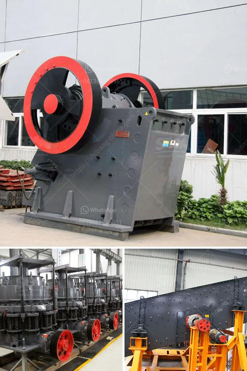

<h3>mobile crusher hire kenya</h3>
Kenya is a country in East Africa renowned for its diverse culture, stunning landscapes, and vibrant wildlife. It is also one of the fastest-growing economies in Africa, with a thriving construction industry. With the increasing demand for construction materials and infrastructure development, the need for mobile crushers has skyrocketed.

Mobile crushers are essential equipment in the construction and mining industries, enabling efficient and cost-effective crushing of materials. They are designed to crush stones and rocks into smaller sizes, which can be used for various purposes, such as road construction, building construction, and aggregate production.

One of the leading companies providing mobile crusher hire services in Kenya is K&B Crushers. Offering a range of mobile crushers, K&B Crushers have years of experience in producing and delivering high-quality aggregate materials throughout Kenya. Their mobile crushing fleet includes jaw crushers, impact crushers, cone crushers, and screens, all equipped with modern technology to ensure efficient crushing of raw materials.

There are several advantages of hiring mobile crushers in Kenya. Firstly, it eliminates the need for transportation of materials, as the crushing can be done on-site. This saves time and money, as transportation costs are eliminated. Mobile crushers also allow for flexibility in terms of location, enabling crushing in different areas as per the project requirements.

Moreover, mobile crushers offer high productivity and efficiency. They are designed to handle large volumes of materials, making them ideal for construction projects of any size. Additionally, the advanced technology integrated into mobile crushers allows for precise and consistent crushing, resulting in high-quality outputs.

In terms of environmental sustainability, mobile crushers are also a better choice compared to traditional crushers. They are typically powered by diesel engines, which have lower emissions compared to older models. Mobile crushers also help reduce waste by transforming waste materials into reusable aggregates, reducing the need for new materials and landfill space.

When hiring mobile crushers in Kenya, it is essential to consider a reliable and experienced provider like K&B Crushers. They have a proven track record of delivering high-quality services and materials to clients across Kenya. With their expertise and state-of-the-art equipment, they ensure that the crushing process is efficient, safe, and meets the client's requirements.

In conclusion, mobile crusher hire services in Kenya are an excellent solution for contractors and builders looking to crush stones and rocks efficiently and cost-effectively. The advantages of mobile crushers, such as their flexibility, high productivity, and environmental sustainability, make them an ideal choice for various construction projects. By hiring a reputable provider like K&B Crushers, clients can rest assured knowing that their crushing needs will be met efficiently and reliably.
<h3>Contact us</h3><ul><li><strong>Whatsapp:&nbsp;<a href="https://wa.me/8613661969651">+8613661969651</a></strong></li><li><a href="https://swt.shibang-china.com/?git&amp;zhl&amp;mobile crusher hire kenya"><strong>Online Service(chat now)</strong></a></li></ul><h3>Related</h3><ul><li><a href='japan directory of mobile crushing plant.md'>japan directory of mobile crushing plant</a></li><li><a href='list of stone crusher plant in bangladesh.md'>list of stone crusher plant in bangladesh</a></li><li><a href='crusher suppliers usa.md'>crusher suppliers usa</a></li><li><a href='fluorite ore processing equipment manufacturer.md'>fluorite ore processing equipment manufacturer</a></li><li><a href='sand washing machine in ethiopia.md'>sand washing machine in ethiopia</a></li></ul>