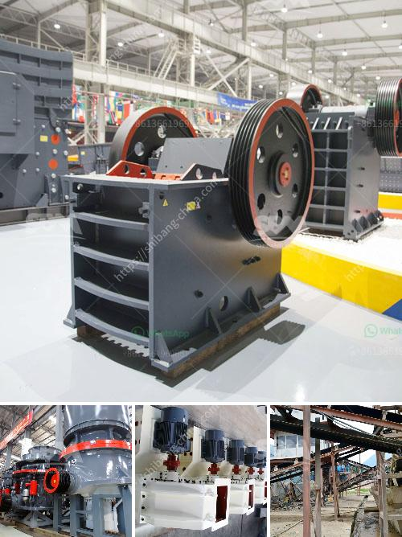

<h3>mobile crusher in sweden</h3>
Sweden is a land of immense natural resources, and it is the nation's largest exporter of iron ore and steel. Sweden's minerals have always played an important role in the country's economy, and that trend continues to this day. With advancements in technology, Sweden's mining industry has thrived with the help of mobile crushers.

An innovative mobile crusher is proving a game-changer to the Swedish mining industry. Portable crushers are being used to break up and crush various rocks and minerals into more manageable sizes, enabling them to be further processed for downstream use.

The mobile crushers utilized in the mining industry in Sweden can be easily transported over long distances, making them efficient for onsite crushing operations. The flexible nature of mobile crushers means they can be moved to the locations where the mineral resources are extracted, reducing the need for costly transportation of extracted materials.

The unique design of mobile crushers ensures that they can efficiently process a wide range of materials, from softer limestone to hard granite or basalt. This versatility allows the crushers to be used in various mining operations. Whether it is in open-pit mining or underground operations, the mobile crusher can tackle any job.

Besides, mobile crushers in Sweden require minimal infrastructure, as they operate on a full-electric track drive system. This eliminates the need for fuel or hydraulic systems, resulting in significant cost savings and reduced emissions. Additionally, advanced automation features enable the crushers to operate with high precision, maximizing productivity and minimizing downtime.

The introduction of mobile crushers in the Swedish mining industry has revolutionized the way minerals are extracted and processed. It has not only made the mining operations more efficient but also minimized their environmental impact. With the ability to be easily transported and their versatility in processing various materials, mobile crushers have become an essential tool for the Swedish mining industry.

In conclusion, mobile crushers have been a game-changer for the mining industry in Sweden. Their ability to process a wide range of materials and be transported to the extraction sites has improved efficiency and reduced costs for mining operations. With the continued advancements in technology, these crushers will likely play an even more significant role in the future of mining in Sweden.
<h3>Contact us</h3><ul><li><strong>Whatsapp:&nbsp;<a href="https://wa.me/8613661969651">+8613661969651</a></strong></li><li><a href="https://swt.shibang-china.com/?git&amp;zhl&amp;mobile crusher in sweden"><strong>Online Service(chat now)</strong></a></li></ul><h3>Related</h3><ul><li><a href='mobile cone crusher hire malaysia.md'>mobile cone crusher hire malaysia</a></li><li><a href='distributor stone crusher surabaya.md'>distributor stone crusher surabaya</a></li><li><a href='vertical roller mill animation gif.md'>vertical roller mill animation gif</a></li><li><a href='mobile gold hammer crusher for sale philippines.md'>mobile gold hammer crusher for sale philippines</a></li><li><a href='providers conveyor belts in mexico.md'>providers conveyor belts in mexico</a></li></ul>