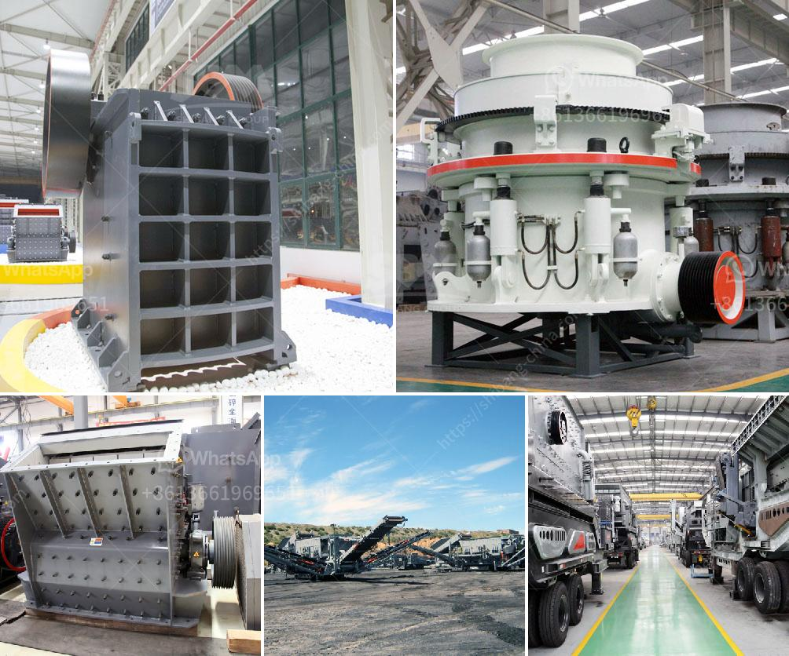

<h3>mobile crusher made in turkey</h3>
Turkey is a country rich in natural resources and is one of the leading countries in mining and construction industries. However, to utilize these resources effectively, the need for high-quality and efficient equipment arises. This is where mobile crushers made in Turkey play a crucial role.

Mobile crushers are essential machines that aid in the crushing of larger rocks and minerals into smaller pieces. These machines are designed to perform various tasks effortlessly and efficiently, making them suitable for various industries such as construction, mining, and recycling.

One of the primary advantages of mobile crushers made in Turkey is their versatility. They come in different sizes and models, allowing users to choose the one that best suits their needs. Whether it's crushing large rocks or recycling materials, these crushers can handle it all. Additionally, they can be easily transported from one site to another, making them perfect for on-site crushing operations.

Another significant advantage of mobile crushers made in Turkey is their fuel efficiency. These machines are designed to minimize fuel consumption while maximizing output. This not only reduces operational costs but also helps in reducing the overall environmental impact. By using less fuel, these crushers contribute to a greener and more sustainable future.

Furthermore, mobile crushers made in Turkey are equipped with advanced technology and features that ensure high productivity and operational efficiency. These machines are often equipped with a powerful engine, a robust crusher unit, and a user-friendly control panel. The combination of these features enables the operators to achieve maximum output with minimal downtime.

Mobile crushers made in Turkey also offer a safe working environment for the operators. They are equipped with safety features such as emergency stop buttons, safety guards, and automatic shut-off systems. Additionally, the crushers are designed to minimize dust and noise emissions, ensuring a healthier and safer work environment for everyone involved.

In terms of maintenance, mobile crushers made in Turkey are relatively easy to maintain. They are designed with accessibility in mind, with easily accessible parts and components. This allows for quick and hassle-free maintenance and reduces downtime. Additionally, many manufacturers provide comprehensive after-sales service and support, ensuring that the crushers remain operational for years to come.

In conclusion, mobile crushers made in Turkey are a valuable addition to any mining or construction operation. Their versatility, fuel efficiency, advanced technology, and safety features make them ideal for a wide range of applications. Whether it's crushing rocks, recycling materials, or reducing environmental impact, these crushers excel in all aspects. With their easy maintenance and comprehensive after-sales support, mobile crushers made in Turkey are an investment worth considering for any business.
<h3>Contact us</h3><ul><li><strong>Whatsapp:&nbsp;<a href="https://wa.me/8613661969651">+8613661969651</a></strong></li><li><a href="https://swt.shibang-china.com/?git&amp;zhl&amp;mobile crusher made in turkey"><strong>Online Service(chat now)</strong></a></li></ul><h3>Related</h3><ul><li><a href='mining process of limestone.md'>mining process of limestone</a></li><li><a href='mini lava rock crusher for homeowner.md'>mini lava rock crusher for homeowner</a></li><li><a href='impact crusher manufacturers china.md'>impact crusher manufacturers china</a></li><li><a href='price list of granite crusher.md'>price list of granite crusher</a></li><li><a href='list of cement plant in india.md'>list of cement plant in india</a></li></ul>