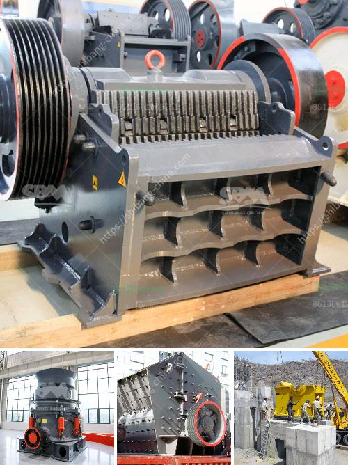

<h3>mobile crusher manufacturers</h3>
Mobile crushers are essential for the crushing of concrete and asphalt of various types. Available in different types, they are used as primary, secondary, as well as tertiary equipment for particle-on-particle crushing or for improving the quality of end material in terms of shape, size, and texture as well as for decreasing the wear and tear of the crusher elements. Mobile crushers are classified into two main categories - Tracked and Wheeled, which enables them to move at different terrains.

With the demand and the trend for mobile crushers growing, manufacturers have been focusing on introducing innovative features and advanced technologies in their equipment. Here, we will discuss some of the leading mobile crusher manufacturers in the industry.

Metso Outotec is one of the prominent manufacturers of mobile crushers. They offer a wide range of mobile crushers that are designed to meet the requirements of various applications. Their Lokotrack® range includes jaw crushers, impact crushers, and cone crushers. These crushers are known for their high performance, reliability, and durability. They are also equipped with intelligent technology, such as Metso Metrics and the IC™ process control system, to optimize the crushing process and maximize productivity.

Another leading manufacturer is Sandvik. They offer a comprehensive range of mobile crushers, including jaw crushers, impact crushers, and cone crushers. Sandvik's mobile crushers are known for their versatility and efficiency. They are equipped with state-of-the-art features, such as the intelligent control system and the My Fleet telematics solution, which enable remote monitoring and optimized utilization of the equipment.

Kleemann is another noteworthy manufacturer of mobile crushers. Their range includes jaw crushers, impact crushers, and cone crushers. Kleemann's mobile crushers are known for their high performance and reliability. They are equipped with features like the Continuous Feed System, which ensures a continuous crusher feed and a high crushing capacity. Kleemann also offers options for hybrid technology, allowing the crushers to run on electricity, reducing fuel consumption and emissions.

Terex Finlay is a renowned manufacturer of mobile crushers. Their range includes jaw crushers, impact crushers, and cone crushers. Terex Finlay's mobile crushers are known for their robust construction and excellent performance. They are equipped with features like the hydrostatic drive system, which offers variable crusher speed and automatic tracking, ensuring efficient crushing operations.

With the increasing demand for mobile crushers, manufacturers are continuously innovating and improving their equipment to cater to the diverse needs of customers. Some of the key factors to consider while choosing a mobile crusher manufacturer include the quality and reliability of the equipment, the availability of spare parts and service, and the manufacturer's reputation in the industry.

In conclusion, mobile crushers have become an essential equipment for the crushing of concrete and asphalt. Leading manufacturers, such as Metso Outotec, Sandvik, Kleemann, and Terex Finlay, offer a wide range of mobile crushers with advanced features and technologies. These crushers are designed to optimize the crushing process, enhance productivity, and provide high-performance solutions for various applications.
<h3>Contact us</h3><ul><li><strong>Whatsapp:&nbsp;<a href="https://wa.me/8613661969651">+8613661969651</a></strong></li><li><a href="https://swt.shibang-china.com/?git&amp;zhl&amp;mobile crusher manufacturers"><strong>Online Service(chat now)</strong></a></li></ul><h3>Related</h3><ul><li><a href='what is the cost of crusher.md'>what is the cost of crusher</a></li><li><a href='second hand small cement mill in uae.md'>second hand small cement mill in uae</a></li><li><a href='stone crusher plant layout pdf.md'>stone crusher plant layout pdf</a></li><li><a href='crusher machine price in sri lanka.md'>crusher machine price in sri lanka</a></li><li><a href='complete scm stone crushing plant.md'>complete scm stone crushing plant</a></li></ul>