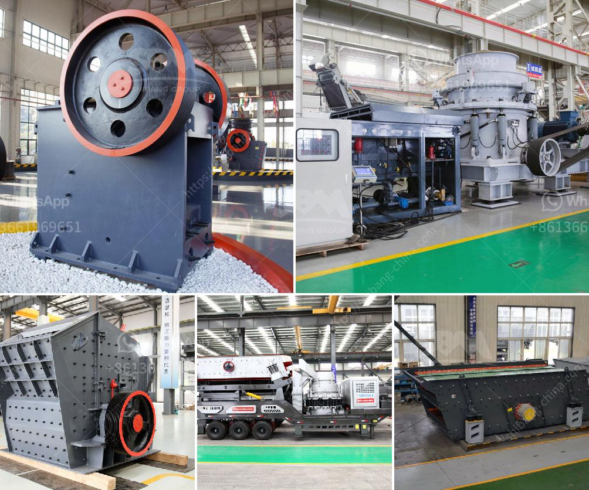

<h3>mobile crusher medium manufacturers japan</h3>
As a leading global manufacturer of crushing, grinding and mining equipments, we offer advanced, reasonable solutions for any size-reduction requirements including quarry, aggregate, and different kinds of minerals. In recent years, mobile crushers have been increasingly employed in the field of environmental recycling that recycles debris from demolished concrete structures as aggregates. TY, as the leading manufacturer of recycling equipment, has pioneered the development of track-mounted, fully mobile crushing plants.

Over 20 years ago, TY was the pioneer manufacturer to start serial production of the mobile units. Today, TY's Mining and Construction Technology has delivered thousands track-mounted mobile crushing plants: for contract crushers, in-pit and mining applications and recycle crushing sites. On the market, the mobile crushers provide high-performance operation, low transportation cost, flexible configuration and user-friendly operation.

Mobile Crusher Medium Manufacturers Japan: Impact crusher spare parts manufacturers selection of stone crusher products at crusher, sand making vsi vertical shaft impact crusher south vsi vertical shaft impact crusher and concrete mixing plant it is the best choice for sand making and stone reshaping low energy consumption,.Buy high quality Japanese ...

Mobile Crusher Medium Manufacturers Japan Jaw Crusher. Medium crushing cone crusher mobile crushing plant is a mobile crushing unit mainly in order to meet the different stone crushing new crusher plants in japan read more japanese stone crushing plant 400 th for sale may 1 2012 made in japan used stone crushing plant 400 th for sale more ...

Mobile Crusher Medium Manufacturers Japan L&M Heavy Industry is a manufacturers of jaw Crusher, cone Crusher, sand making machine, vsi impact crusher, mobile crusher plant and vertical mill, ultra-fine grinding, tricyclic medium-speed micro-grinding, coarse powder, pulverized .Used mobile stone crushers japan asbreganzonach. mobile crusher sale ...

Aug 03, 2013mobile crusher medium manufacturers japan. mobile crusher medium manufacturers japan As a leading global manufacturer of crushing grinding and mining equipments we offer advanced reasonable solutions for any size-reduction requirements including quarry aggregate and different kinds of minerals Get more. Offers 1,912 Crusher Suppliers, and Crusher Manufacturers, Distributors, Factories, Companies. There are 1,178 OEM, 1,109 ODM, 341 Self Patent. Find high quality Crusher Suppliers on Alibaba. - Portable Rock Crusher - Gold Mining This rock crusher does a fine job. It will crush small 2 in. X 2in. rocks into dust in a matter of a minute. Harvard University, a foundation of philanthropy that desires to provide research and instruction weight across the world education. It was founded in 1636, Cambridge, Massachusetts and named after its first benefactor, young clergyman John Harvard, who had left the institution his library of four hundred books and a sum of money equal for a half-year's salary.
<h3>Contact us</h3><ul><li><strong>Whatsapp:&nbsp;<a href="https://wa.me/8613661969651">+8613661969651</a></strong></li><li><a href="https://swt.shibang-china.com/?git&amp;zhl&amp;mobile crusher medium manufacturers japan"><strong>Online Service(chat now)</strong></a></li></ul><h3>Related</h3><ul><li><a href='iron ore to iron process made in canada.md'>iron ore to iron process made in canada</a></li><li><a href='silica quartz crusher processing.md'>silica quartz crusher processing</a></li><li><a href='cost of dolomite milling machine in india.md'>cost of dolomite milling machine in india</a></li><li><a href='gypsum crusher specification.md'>gypsum crusher specification</a></li><li><a href='calculation of a cost of a crusher.md'>calculation of a cost of a crusher</a></li></ul>