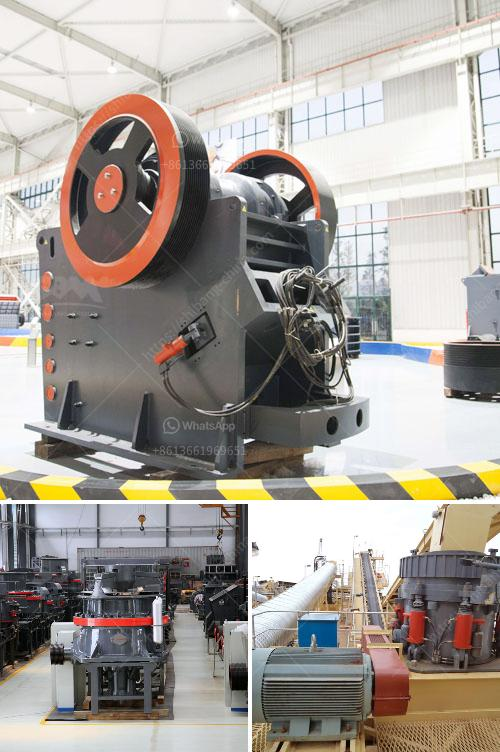

<h3>mobile crusher morocco</h3>
Mobile crushers have proven to be a major asset for mining companies around the world, providing a cost-effective and efficient solution to crushing and recycling materials. In Morocco, the application of mobile crushers has brought drastic changes to the mining industry, enhancing productivity and boosting profits.

The mobile crusher is a breakthrough in mining equipment, as it is both efficient and compact - allowing for ease of transportation and quick installation. With the ability to crush materials directly on-site, it eliminates the need for costly infrastructure, such as conveyor belts and crushing stations. This not only saves on operational costs but also reduces the carbon footprint by eliminating the need for transportation of materials to a centralized location.

One of the key advantages of mobile crushers in Morocco is their versatility. They can handle a wide range of materials, from rocks and ores to concrete and asphalt. This flexibility allows mining companies to crush and process various types of materials on-demand, making them more efficient in resource utilization. The on-site crushing also minimizes the risk of material contamination or degradation during transportation, further ensuring the quality of the final product.

In addition to its versatility, the mobile crusher provides significant time and cost savings. Traditional methods of crushing, such as stationary crushers or manual labor, require a significant amount of time and manpower. Mobile crushers, on the other hand, are designed for rapid deployment and quick setup. They can be operational within minutes, providing immediate access to crushing capabilities. This quick turnaround time allows mining companies to streamline their operations and maximize their productivity.

Furthermore, the mobile crusher in Morocco offers enhanced safety features to protect both the workers and the equipment. These crushers are equipped with advanced technology and safety devices, ensuring safe operation and preventing any untoward incidents. This significantly reduces the risk of accidents and injuries, creating a safer working environment for everyone involved.

The adoption of mobile crushers in Morocco has also had a positive impact on the environment. With the reduction in transportation requirements, there is a corresponding decrease in fuel consumption and greenhouse gas emissions. Additionally, the ability to recycle materials on-site reduces the need for mining new resources, promoting sustainable practices and conservation of natural resources.

Overall, the mobile crusher in Morocco has revolutionized the mining industry by providing an efficient and eco-friendly solution for crushing and recycling materials. Its versatility, cost-effectiveness, and enhanced safety features have made it an invaluable asset for mining companies. As the demand for mobile crushers continues to grow, it is expected that its adoption will become more prevalent across the mining industry, further improving productivity and sustainability.
<h3>Contact us</h3><ul><li><strong>Whatsapp:&nbsp;<a href="https://wa.me/8613661969651">+8613661969651</a></strong></li><li><a href="https://swt.shibang-china.com/?git&amp;zhl&amp;mobile crusher morocco"><strong>Online Service(chat now)</strong></a></li></ul><h3>Related</h3><ul><li><a href='mining heavy equipment price list.md'>mining heavy equipment price list</a></li><li><a href='vertical roller mill gearboxes.md'>vertical roller mill gearboxes</a></li><li><a href='ball mill magnetic separator.md'>ball mill magnetic separator</a></li><li><a href='lime powder suppliers in patna.md'>lime powder suppliers in patna</a></li><li><a href='stone crusher price ton per day.md'>stone crusher price ton per day</a></li></ul>