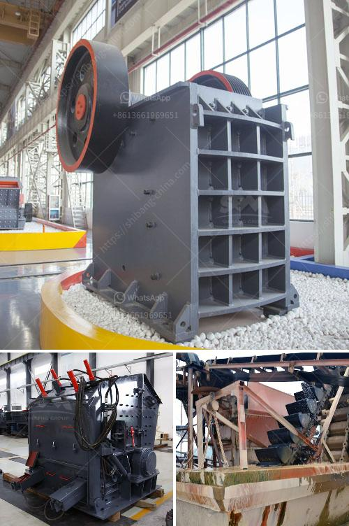

<h3>mobile crusher price and option</h3>
Today, mobile crushing plants are also used in granite quarries, basalt quarries, limestone quarries and other mineral mining sites. In fact, stone crusher plant is designed to be used as a primary crushing machine with all the right components and features needed for efficient operation, crushing rock, gravel and recyclables. Today many of these machines are highly automated, and fully-maintained to ensure efficient processing.

When considering the price of mobile crushing plants, there are several factors to consider - equipment configuration, fuel consumption, labor costs, installation costs and maintenance costs. These aspects should be taken into account to select the most suitable equipment for your specific mining operation.

Firstly, let's take a look at the equipment configuration of the mobile crusher plant. Mobile crusher plant is divided into several types - jaw crusher plant, cone crusher plant, impact crusher plant, and hammer crusher plant. The equipment configuration is different for different materials. For example, for limestone, it is mainly composed of jaw crusher, cone crusher, and impact crusher. For granite, the configuration is more complicated. For example, a crushing line can be composed of jaw crusher, cone crusher, impact crusher, and screening machine. 

Secondly, fuel consumption is another crucial factor affecting the mobile crusher price. Fuel efficiency directly affects the overall operating costs of a mobile crusher. For example, the production capacity and fuel consumption of a Tyre-type mobile crushing equipment are relatively small, but due to the use of the track drive system, the equipment can walk in any challenging road conditions, which significantly reduces fuel consumption. Therefore, when considering a mobile crusher, it is important to consider the energy consumption of the machine.

Thirdly, labor costs should also be considered when comparing different mobile crusher options. Some mobile crushers are fully automated and require less human intervention, while others may require an operator to monitor the machine and handle maintenance issues. The overall labor costs need to be taken into account when analyzing the available options.

Installation costs are also important to consider. While some mobile crushing plants can be easily transported and set up within a short period of time, others may require more complex installation procedures. In addition, the site conditions and the need for infrastructure development may also affect the installation costs.

Lastly, maintenance costs should not be overlooked. Regular and proper maintenance is crucial to ensure the performance and longevity of mobile crushers. Some machines may require more frequent maintenance or have higher spare part costs, which could influence the overall cost of ownership.

Ultimately, selecting the right mobile crusher is a balance between price, options, and specific requirements. The aforementioned factors are all important in evaluating the cost-effectiveness of a mobile crusher. It is advisable to consult with experts in the field to determine the best option for your operation. A well-chosen mobile crushing plant will undoubtedly bring higher profits and greater success to your mining business.
<h3>Contact us</h3><ul><li><strong>Whatsapp:&nbsp;<a href="https://wa.me/8613661969651">+8613661969651</a></strong></li><li><a href="https://swt.shibang-china.com/?git&amp;zhl&amp;mobile crusher price and option"><strong>Online Service(chat now)</strong></a></li></ul><h3>Related</h3><ul><li><a href='concrete crusher prices.md'>concrete crusher prices</a></li><li><a href='400 tph mobile coal crusher plant manufacturer.md'>400 tph mobile coal crusher plant manufacturer</a></li><li><a href='mobile crusher hire kenya.md'>mobile crusher hire kenya</a></li><li><a href='industr gold mining equipment and prices.md'>industr gold mining equipment and prices</a></li><li><a href='machine that crushes stones to ballast.md'>machine that crushes stones to ballast</a></li></ul>