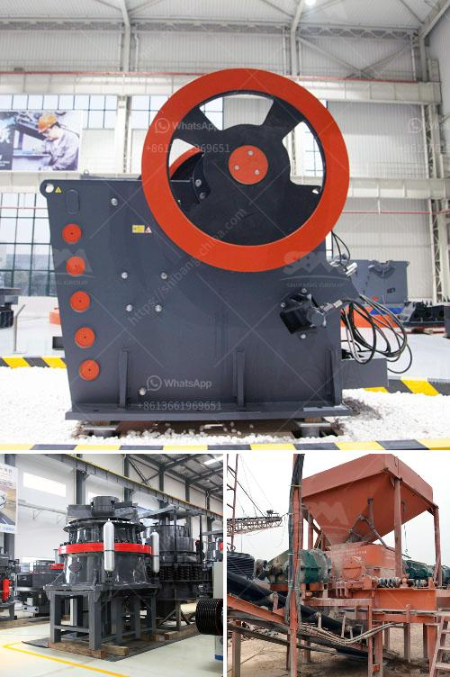

<h3>mobile crusher price list</h3>
With the rapid development of the mobile phone industry and the booming increase in technological advancements, it is no surprise that people are now more reliant on their mobile devices than ever before. Mobile phones have become an integral part of our lives, helping us communicate, navigate, and access information with just a few taps on a screen.

However, as remarkable as mobile phones are, they pale in comparison to mobile crushers when it comes to crushing rocks, stones, and other materials. Mobile crushers are heavy-duty machines designed to crush large rocks into smaller ones, making them useful for construction projects, quarries, and mining operations. If you are considering buying a mobile crusher, it is essential to have a good understanding of their price list and how to select the best one for your needs.

When it comes to mobile crusher prices, there are various factors that influence the cost. The size and capacity of the machine are crucial determinants, as larger crushers with higher capacity tend to be pricier. Additionally, brand reputation and the specific features and capabilities of the crusher may impact its price. Different manufacturers offer various models and options, providing different price ranges to choose from.

It is advisable to begin your search by comparing prices from different manufacturers. This will give you a good idea of the average price range and help you delineate the models that fall within your budget. While price is an important consideration, it is equally important to assess the quality and reliability of the crusher. Look for reputable manufacturers known for producing high-quality mobile crushers that can withstand harsh conditions and deliver consistent performance.

Before finalizing your decision, it is essential to evaluate your specific needs and requirements. Consider the type of materials you will be crushing, the desired output size, and the production capacity you need. Different crushers excel at crushing different materials and have varying capacities. Some crushers are designed for primary crushing, while others are ideal for secondary or tertiary crushing. Ensure that the mobile crusher you select is suitable for your intended use.

Furthermore, consider the mobility and transportability of the crusher. Mobile crushers are designed to be easily moved from one location to another, allowing for flexibility in operations. However, some models may be more easily transported than others. Consider the weight, size, and ease of dismantling and reassembling the crusher when needed.

Lastly, don't forget to consider the after-sales service and warranty offered by the manufacturer. A good warranty will provide peace of mind and ensure that you are protected from unexpected issues or defects. Additionally, reliable after-sales service can be essential for maintenance, repairs, and spare parts availability.

In conclusion, when purchasing a mobile crusher, it is crucial to understand the price list and considerations that impact it. Compare prices, evaluate the quality, assess your specific needs, and consider mobility and after-sales service. By doing so, you will be armed with the necessary knowledge to choose the best mobile crusher for your construction, quarrying, or mining needs. Remember, investing in a reliable and efficient mobile crusher is an investment in the success of your projects.
<h3>Contact us</h3><ul><li><strong>Whatsapp:&nbsp;<a href="https://wa.me/8613661969651">+8613661969651</a></strong></li><li><a href="https://swt.shibang-china.com/?git&amp;zhl&amp;mobile crusher price list"><strong>Online Service(chat now)</strong></a></li></ul><h3>Related</h3><ul><li><a href='malaysia coconut grinder machine.md'>malaysia coconut grinder machine</a></li><li><a href='crushing and screening contractors in gauteng.md'>crushing and screening contractors in gauteng</a></li><li><a href='crusher machine price in sri lanka.md'>crusher machine price in sri lanka</a></li><li><a href='used nd hand coal crusher sizer.md'>used nd hand coal crusher sizer</a></li><li><a href='dolomite powder machine in sri lanka.md'>dolomite powder machine in sri lanka</a></li></ul>