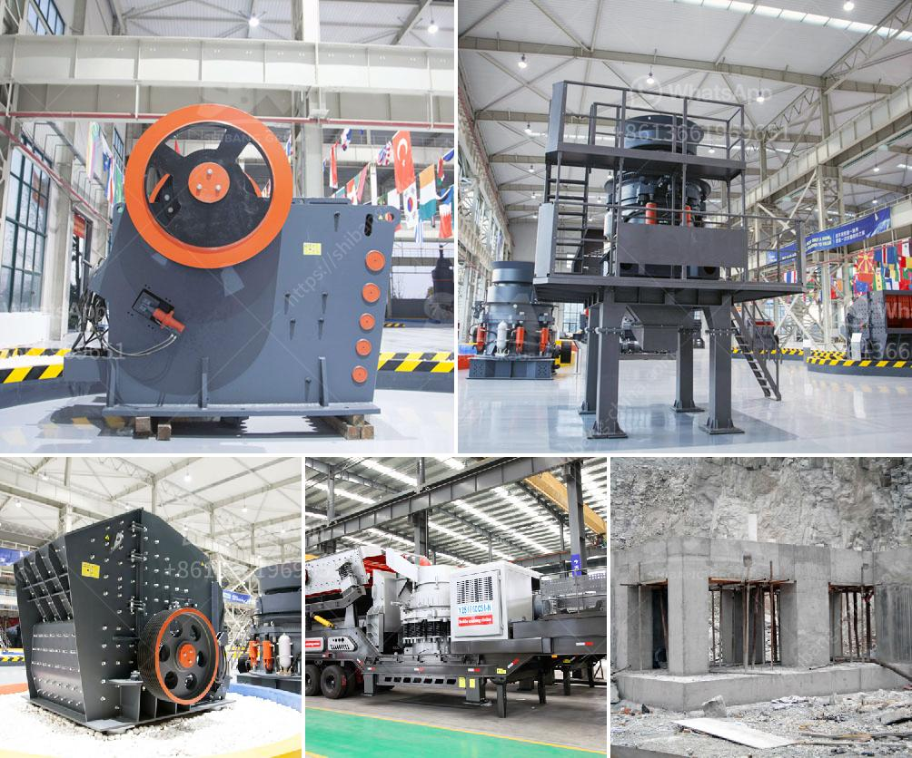

<h3>mobile crusher rent uae</h3>
Mobile crushers are becoming increasingly popular in the mining and construction industry due to their ease of use and versatility. They can be used for crushing a wide variety of materials including concrete, asphalt, limestone, and more. Renting mobile crushers in UAE allows contractors to easily move the equipment to different job sites and complete their projects efficiently.

One of the main benefits of renting mobile crushing equipment is its flexibility. Instead of investing in a permanent crusher that may not be utilized at all times, renting allows contractors to only pay for the equipment when it is needed. This can greatly reduce costs, especially for smaller construction companies or those with fluctuating workloads.

Another advantage of renting mobile crushers in UAE is the ease of transportation. Most rental units are mounted on tracks, allowing them to be easily moved around the job site. This is particularly beneficial for larger projects that require multiple stages of crushing as the equipment can be relocated as needed. Additionally, the compact size of mobile crushers makes them ideal for working in tight spaces, such as urban areas or confined job sites.

Renting mobile crushing equipment also eliminates the need for maintenance and repairs. Equipment rental companies are responsible for the maintenance and upkeep of their units, ensuring that they are in good working condition. This saves contractors the time and expense of hiring mechanics or purchasing spare parts. If the rented crusher breaks down, the rental company will typically provide a replacement unit, minimizing downtime and allowing the project to continue without delay.

The availability of various sizes and types of mobile crushers for rent in UAE is another advantage. Different projects may require different types of crushers, such as jaw crushers for primary crushing or cone crushers for secondary crushing. Some companies may also require additional features, such as screening capabilities or a magnetic separator to remove magnetic materials from the crushed material. Renting allows contractors to choose the specific type of crusher that best suits their needs.

In conclusion, renting mobile crushers in UAE offers numerous benefits for contractors in the mining and construction industry. It provides flexibility, cost savings, ease of transportation, and eliminates the need for maintenance and repairs. With the availability of various sizes and types of crushers, contractors can choose the most suitable equipment for their projects. By opting for mobile crusher rentals, contractors can improve efficiency and productivity while reducing costs.
<h3>Contact us</h3><ul><li><strong>Whatsapp:&nbsp;<a href="https://wa.me/8613661969651">+8613661969651</a></strong></li><li><a href="https://swt.shibang-china.com/?git&amp;zhl&amp;mobile crusher rent uae"><strong>Online Service(chat now)</strong></a></li></ul><h3>Related</h3><ul><li><a href='price rock crusher.md'>price rock crusher</a></li><li><a href='working machine of a stone crusher.md'>working machine of a stone crusher</a></li><li><a href='cone crushers manufacturer.md'>cone crushers manufacturer</a></li><li><a href='used stone crusher on sale in jharkhand.md'>used stone crusher on sale in jharkhand</a></li><li><a href='process of granite mining crusher machines used.md'>process of granite mining crusher machines used</a></li></ul>