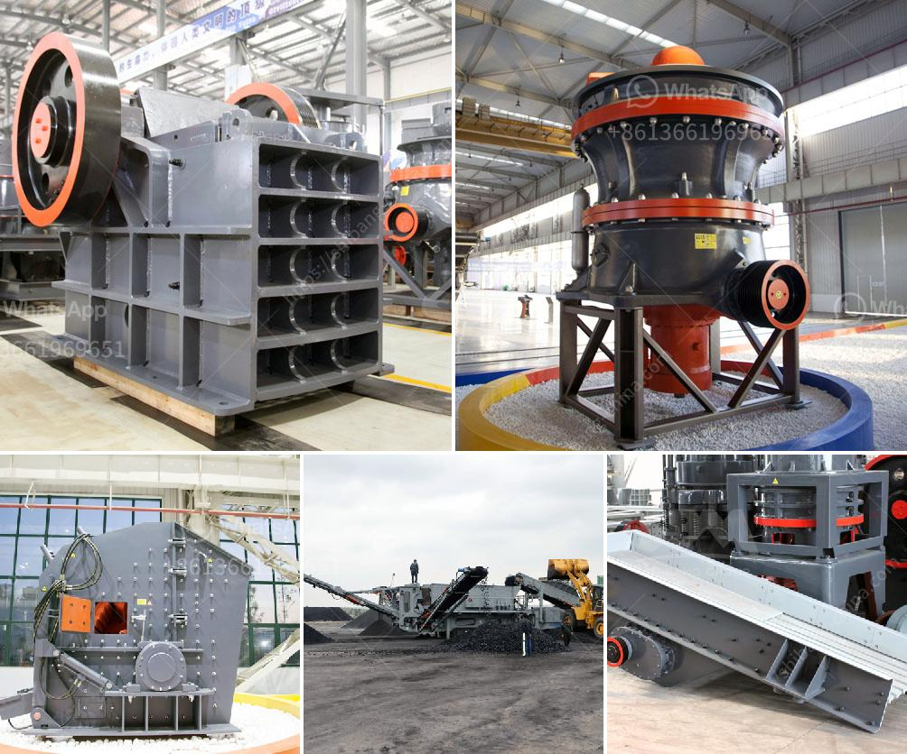

<h3>mobile crusher sale price</h3>
Mobile crushers are essential machinery in construction, mining, and other industries. They allow for the crushing of rocks and ore into smaller sizes, which is crucial for efficient processing. The market for mobile crushers has been growing steadily in recent years, with manufacturers offering a range of models at varying price points.

The sale price of a mobile crusher is influenced by several factors such as brand, model, capacity, and features. Most mobile crushers are powered by either diesel or electric engines. Both come with their own advantages and disadvantages, which influence the selling price.

Diesel-powered crushers are generally more powerful and offer higher crushing capacity. They are also more mobile and can be easily transported to different work sites. However, diesel fuel is expensive, and the cost of operating these crushers can be higher in the long run.

On the other hand, electric-powered crushers are more energy-efficient and environmentally friendly. They are quieter and produce fewer emissions, making them suitable for use in urban areas. The operational cost of electric crushers is generally lower than that of diesel-powered ones, making them more cost-effective in the long term.

The capacity of the mobile crusher also affects its sale price. Larger crushers with higher capacity are generally priced higher due to their ability to handle more material at a faster rate. However, it's important for buyers to assess their specific needs and opt for a crusher with the appropriate capacity to avoid overpaying for unnecessary features.

Additional features like screens, conveyors, and magnets can also increase the sale price of a mobile crusher. These accessories enhance the functionality and versatility of the crusher, enabling it to handle a wider range of materials and applications.

The price range for mobile crushers varies significantly depending on the factors mentioned above. Entry-level crushers can start from as low as $50,000, while high-end models can exceed $1 million. It's essential for buyers to carefully evaluate their budget and requirements before making a purchase decision.

In conclusion, the sale price of a mobile crusher is influenced by a variety of factors, including brand, model, capacity, and additional features. Buyers should consider these factors carefully to ensure they choose a crusher that meets their needs and budget. With a wide range of options available in the market, there is a mobile crusher for every requirement and budget.
<h3>Contact us</h3><ul><li><strong>Whatsapp:&nbsp;<a href="https://wa.me/8613661969651">+8613661969651</a></strong></li><li><a href="https://swt.shibang-china.com/?git&amp;zhl&amp;mobile crusher sale price"><strong>Online Service(chat now)</strong></a></li></ul><h3>Related</h3><ul><li><a href='crusher plant project report pdf.md'>crusher plant project report pdf</a></li><li><a href='limestone mines for sale in cambodia.md'>limestone mines for sale in cambodia</a></li><li><a href='used raymond roller mills for sale.md'>used raymond roller mills for sale</a></li><li><a href='cost of roller crusher.md'>cost of roller crusher</a></li><li><a href='mining equipment bow mills in zimbabwe.md'>mining equipment bow mills in zimbabwe</a></li></ul>