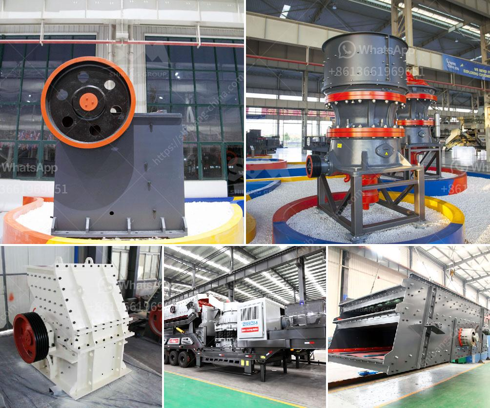

<h3>mobile crusher specification</h3>
Mobile crushers are essential for the crushing of stones and concrete in construction waste recycling projects. With the increasing popularity of mobile crushing plants, the specifications of these machines are now being updated and optimized to cater to the changing demands of the market.

One of the primary factors to consider when choosing a mobile crusher is the material being crushed. Different crushers are designed to handle specific types of materials, such as limestone, granite, or concrete. Therefore, it is important to select a machine that is suitable for the intended task.

The size of the feed material is another crucial specification to look out for. Mobile crushers have different capacities, and the size of the material being fed into the machine will determine its output capacity. It is vital to choose a crusher with the appropriate feed size to ensure efficient and effective crushing.

Another essential specification to consider is the power source of the machine. Mobile crushers can be powered by diesel engines or electric motors. Diesel-powered crushers are usually more suitable for remote areas where electricity supply is unreliable or nonexistent. On the other hand, electric-powered crushers offer a more environment-friendly option and are preferred for urban areas.

The mobility of the machine is another specification that should not be overlooked. Mobile crushers are designed to be easily transported from one location to another, so features like hydraulically folding conveyors and tracks or wheels are necessary for efficient and smooth transportation.

Moreover, it is important to consider the ease of operation and maintenance when selecting a mobile crusher. Find a machine that is equipped with user-friendly controls and has easy access to key parts for regular maintenance and servicing.

In conclusion, mobile crusher specifications play a significant role in determining the suitability of a machine for a particular crushing task. Material, feed size, power source, mobility, and ease of operation and maintenance are all important factors to consider when choosing a mobile crusher. By carefully evaluating these specifications, one can ensure that they select the right machine for their crushing needs.
<h3>Contact us</h3><ul><li><strong>Whatsapp:&nbsp;<a href="https://wa.me/8613661969651">+8613661969651</a></strong></li><li><a href="https://swt.shibang-china.com/?git&amp;zhl&amp;mobile crusher specification"><strong>Online Service(chat now)</strong></a></li></ul><h3>Related</h3><ul><li><a href='mining of granite companies.md'>mining of granite companies</a></li><li><a href='concrete stones crushing business plan.md'>concrete stones crushing business plan</a></li><li><a href='iron crushing equipment for sale.md'>iron crushing equipment for sale</a></li><li><a href='10tph mobile stone crusher with vibrating screen.md'>10tph mobile stone crusher with vibrating screen</a></li><li><a href='conveyor belts for sale in china.md'>conveyor belts for sale in china</a></li></ul>