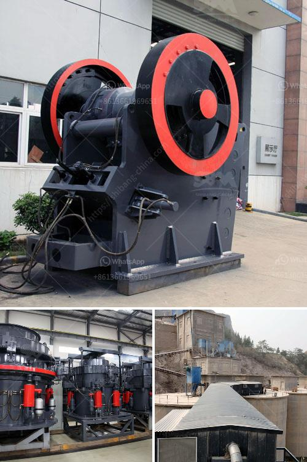

<h3>mobile crushers for hire in philippines</h3>
Mobile crushers are heavy-duty equipment that helps to break down large chunks of rock, concrete, and other materials into smaller pieces. They have become a popular option for on-site crushing operations due to their mobility and versatility. In the Philippines, mobile crushers are available for hire in different sizes and capacities, ranging from 50 to 300 tons per hour.

To cater to the needs of various industries, mobile crushers are designed with different types of crushers such as jaw crushers, cone crushers, impact crushers, and others. These crushers can be easily transported from one site to another, enabling efficient crushing operations at multiple locations.

One of the major advantages of mobile crushers is their ability to crush materials directly at the construction site. This eliminates the need to transport the materials to a stationary crusher, saving time and cost. Mobile crushers are ideal for handling materials such as construction waste, concrete, asphalt, and natural stone.

Another advantage of mobile crushers is their flexibility. They can be adjusted to different crushing requirements, allowing operators to produce various sizes of aggregates. The crusher can also be easily adapted to different applications by changing the screening attachments. This versatility makes mobile crushers a valuable asset for construction companies and quarry operators.

Hiring mobile crushers in the Philippines offers a cost-effective and convenient solution to crushed stone production. Mobile crushers offer flexibility and efficiency that traditional crushers cannot provide. In addition, mobile crushing equipment minimizes the chances of accidents during operation, thereby ensuring worker safety.

Overall, mobile crushers for hire in the Philippines are a practical choice for construction companies and quarry operators. They offer versatility, mobility, and efficiency, making them an attractive option for on-site crushing operations. With various sizes and capacities available, there is a mobile crusher to suit the specific requirements of any project.
<h3>Contact us</h3><ul><li><strong>Whatsapp:&nbsp;<a href="https://wa.me/8613661969651">+8613661969651</a></strong></li><li><a href="https://swt.shibang-china.com/?git&amp;zhl&amp;mobile crushers for hire in philippines"><strong>Online Service(chat now)</strong></a></li></ul><h3>Related</h3><ul><li><a href='50 tph stone crusher plant.md'>50 tph stone crusher plant</a></li><li><a href='equipos para triturado de mineria.md'>equipos para triturado de mineria</a></li><li><a href='crushers plant cost.md'>crushers plant cost</a></li><li><a href='wet ball milling.md'>wet ball milling</a></li><li><a href='kenya stone crusher.md'>kenya stone crusher</a></li></ul>