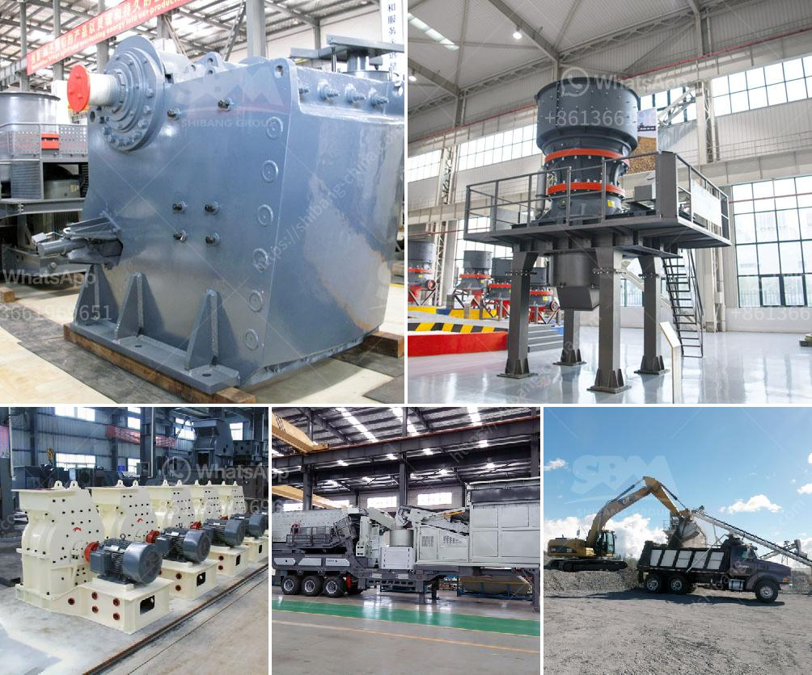

<h3>mobile crushers gravels</h3>
Mobile crushers are essential pieces of machinery for the mining and construction industries. These machines convert large rocks into smaller, more manageable sizes, allowing them to be used in various construction projects. One type of mobile crusher that has gained popularity over the years is the gravel crusher.

Gravel crushers are designed to break down stones, gravels, and rocks into smaller sizes. They can be used in various applications, such as construction materials, road building, and landscaping. The primary purpose of a gravel crusher is to make the material suitable for further processing or usage.

What sets mobile gravel crushers apart from their stationary counterparts is their portability. These crushers can be easily transported to different sites, which is essential for construction projects that require on-site crushing of gravels. By eliminating the need for transportation of materials, mobile crushers save time and money, making them a cost-effective solution.

Mobile gravel crushers come in different types and sizes, depending on the specific requirements of the project. Jaw crushers, impact crushers, and cone crushers are commonly used for this purpose. Each type has its own advantages and features, making them suitable for different applications.

The process of crushing gravels with a mobile crusher starts with loading the material into the crusher's hopper. The materials are then fed into the crusher's chamber, where the rotating hammers or jaws break them down into smaller sizes. The crushed material is then discharged through the crusher's opening, ready for further processing or usage.

Overall, mobile gravel crushers are essential equipment for the mining and construction industries. They provide a cost-effective solution for crushing gravels on-site, eliminating the need for transportation. With their versatility and portability, these crushers make it easier to process and use gravels in various construction projects. Whether it's building roads or landscaping, mobile gravel crushers play a crucial role in making the process efficient and productive.
<h3>Contact us</h3><ul><li><strong>Whatsapp:&nbsp;<a href="https://wa.me/8613661969651">+8613661969651</a></strong></li><li><a href="https://swt.shibang-china.com/?git&amp;zhl&amp;mobile crushers gravels"><strong>Online Service(chat now)</strong></a></li></ul><h3>Related</h3><ul><li><a href='copper leaching plants for sale.md'>copper leaching plants for sale</a></li><li><a href='used stone crusher on sale in jharkhand.md'>used stone crusher on sale in jharkhand</a></li><li><a href='new crushing machine in south africa.md'>new crushing machine in south africa</a></li><li><a href='silica sand production line in german.md'>silica sand production line in german</a></li><li><a href='fluorite ore processing equipment manufacturer.md'>fluorite ore processing equipment manufacturer</a></li></ul>