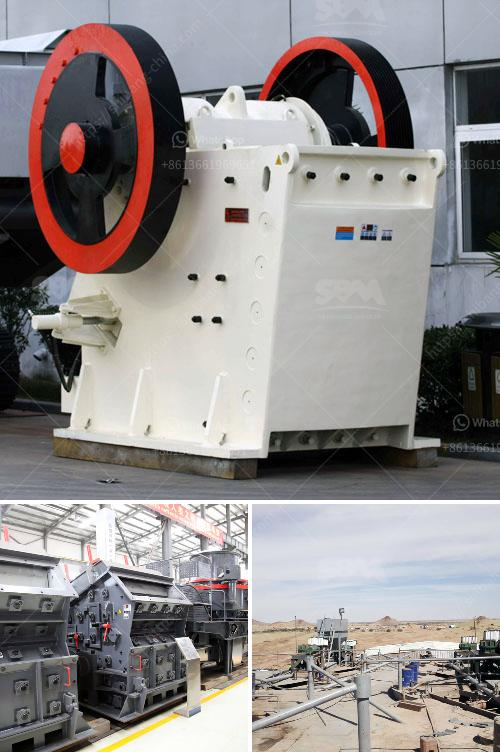

<h3>mobile crushers on tracks</h3>
In today's construction industry, efficiency and productivity are crucial factors to consider when purchasing equipment. Mobile crushers on tracks offer a compact, versatile, and cost-effective solution for many construction tasks. These highly mobile machines enable fast and easy set-up and dismantling, resulting in reduced downtime and increased job site productivity. With their ability to crush a wide range of materials, mobile crushers on tracks have become a popular choice for many construction professionals.

One of the key advantages of mobile crushers on tracks is their mobility. These machines are equipped with tracks instead of wheels, allowing them to move easily across various terrains, including rough and uneven surfaces. This mobility makes it possible to bring the crushing operation directly to the job site, eliminating the need for costly transportation of materials. Whether it is a demolition project, quarrying operation, or road construction, mobile crushers on tracks ensure efficient crushing on the go.

Another significant benefit of mobile crushers on tracks is their compact design. These machines are typically smaller and lighter compared to traditional crushers, making them ideal for working in tight spaces or confined areas. Whether it's a small construction site or an urban environment with limited access, mobile crushers on tracks can navigate through narrow passages and deliver effective crushing with minimal disruption to the surroundings.

Furthermore, mobile crushers on tracks offer versatility in terms of crushing capabilities. These machines are designed to crush a wide range of materials, including concrete, asphalt, and natural stones. With adjustable settings, operators can achieve various sizes and specifications of crushed materials, making it possible to produce different grades of aggregate on site. This versatility not only saves time and money but also reduces the need for additional equipment and resources.

The advanced technology integrated into mobile crushers on tracks further enhances their operational efficiency. These machines are equipped with powerful engines, hydraulic systems, and remote control functionality, enabling operators to adjust settings and monitor the crushing process from a safe distance. Additionally, some models feature a vibrating feeder, a pre-screening system, or a magnetic separator, ensuring optimal performance and high-quality output.

Environmental considerations are increasingly important in the construction industry, and mobile crushers on tracks are designed with sustainability in mind. These machines are equipped with diesel engines that meet stringent emission standards, reducing their environmental impact. Additionally, the ability to crush materials on site eliminates the need for excessive transportation, further reducing carbon emissions associated with traditional crushing methods.

In conclusion, mobile crushers on tracks have revolutionized the construction industry by offering efficient, versatile, and environmentally friendly crushing solutions. These machines provide mobility, compactness, and powerful crushing capabilities, enabling construction professionals to optimize productivity and reduce costs. Whether it's a small-scale project or a large-scale operation, mobile crushers on tracks offer the flexibility and performance required for success in the modern construction industry.
<h3>Contact us</h3><ul><li><strong>Whatsapp:&nbsp;<a href="https://wa.me/8613661969651">+8613661969651</a></strong></li><li><a href="https://swt.shibang-china.com/?git&amp;zhl&amp;mobile crushers on tracks"><strong>Online Service(chat now)</strong></a></li></ul><h3>Related</h3><ul><li><a href='stone cape crusher for sale china.md'>stone cape crusher for sale china</a></li><li><a href='conveyor belt for crusher china.md'>conveyor belt for crusher china</a></li><li><a href='mining process of limestone.md'>mining process of limestone</a></li><li><a href='limestone rock crushing company.md'>limestone rock crushing company</a></li><li><a href='sand screw professional apr.md'>sand screw professional apr</a></li></ul>