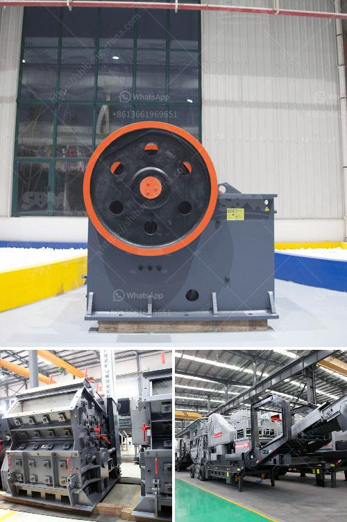

<h3>mobile crushing and screening to hire south africa</h3>
Mobile crushing and screening equipment has been a proven and reliable performance in the construction industry for decades. It offers flexibility in the production of material for various purposes including recycling of construction waste, demolition debris, quarrying, and mining applications. In South Africa, this innovative solution is a viable alternative to the traditional stationary crusher and screen setups.

Mobile crushing and screening units are well suited for demolition and recycling jobs, as well as quarries and other aggregate production facilities. It allows for various sized material to be generated from a single machine, making it ideal for contractors who require multiple sized products. With the ability to crush material directly at the job site, it eliminates the need for expensive transportation of materials to and from a stationary processing facility.

One of the major benefits of mobile crushing and screening equipment is its flexibility. Contractors have the option to move the equipment from one site to another, making it an attractive choice for projects with multiple locations or short-term requirements. This versatility allows for increased productivity and reduced downtime as the equipment can be easily transported and set up at different job sites quickly.

Moreover, mobile units are equipped with advanced technology and features that enhance efficiency and productivity. They are designed to handle a wide range of applications and materials, including hard and abrasive rock, gravel, coal, and even asphalt. The equipment offers high capacity and throughput, allowing for large volumes of material to be processed in a short period.

In South Africa, mobile crushing and screening equipment for hire has been in demand over recent years. With more and more contractors moving towards site-specific mobile units, the demand for portable crushing and screening equipment is growing.

To meet this demand, various rental companies are providing these services. These rental companies offer a range of mobile crushing and screening units for short-term hire to long-term lease arrangements. The equipment is well-maintained and regularly serviced to ensure optimal performance and reliability on the job site.

The availability of mobile crushing and screening units for hire in South Africa has significantly increased over the years. This has created opportunities for small to medium-sized contractors, as well as large-scale contractors, to expand their fleet and carry out crushing and screening operations efficiently.

With mobile crushing and screening equipment readily available and affordable, South African contractors can now take advantage of the benefits this machinery offers. With the ability to rent these units, contractors can maximize their fleet utilization and reduce overhead costs associated with purchasing and maintaining their own equipment.

In conclusion, mobile crushing and screening equipment for hire in South Africa offers a cost-effective and flexible solution for crushing and screening requirements. With the ability to move machinery to the job site and operate remotely, contractors can produce the required material on-site, enhancing efficiency and reducing transportation costs. Rental companies provide well-maintained equipment with advanced features, ensuring optimal performance and productivity. With the availability of mobile crushing and screening units, contractors can confidently take on various projects and meet the demand for high-quality materials.
<h3>Contact us</h3><ul><li><strong>Whatsapp:&nbsp;<a href="https://wa.me/8613661969651">+8613661969651</a></strong></li><li><a href="https://swt.shibang-china.com/?git&amp;zhl&amp;mobile crushing and screening to hire south africa"><strong>Online Service(chat now)</strong></a></li></ul><h3>Related</h3><ul><li><a href='project cost of tpd ofcement plant in pakistan.md'>project cost of tpd ofcement plant in pakistan</a></li><li><a href='high performance mobile crusher plant.md'>high performance mobile crusher plant</a></li><li><a href='industrial ball mill for sale.md'>industrial ball mill for sale</a></li><li><a href='captains of crusher zenith.md'>captains of crusher zenith</a></li><li><a href='ball mill for sale in india.md'>ball mill for sale in india</a></li></ul>