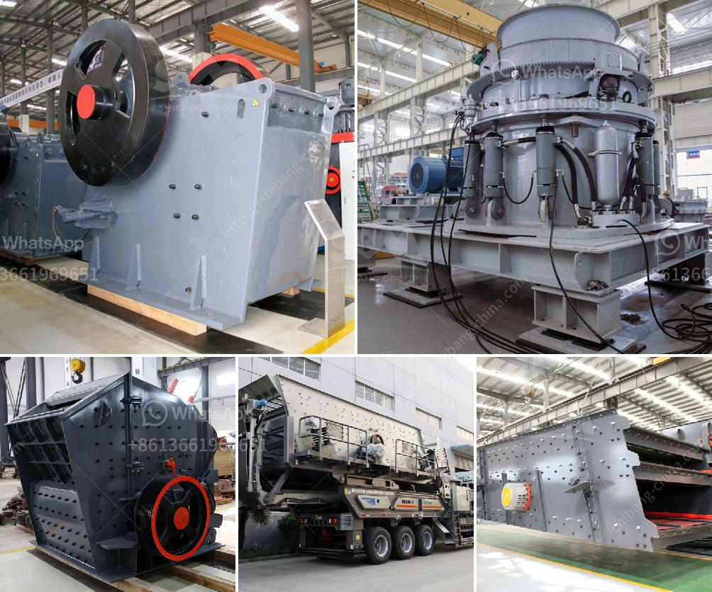

<h3>mobile crushing plant philippines</h3>
The mobile crushing plant is a type of machine that is used for crushing material with different hardness levels and sizes. It is commonly used in the mining and construction industries for various purposes such as recycling materials, demolition waste, and quarrying. The mobile crushing plant Philippines is an excellent investment opportunity for both short-term and long-term projects.

One of the primary advantages of owning a mobile crushing plant is that it allows you to take advantage of different crushing equipment. This flexibility enables you to choose the most suitable equipment for specific tasks, ensuring efficient operations. Whether you are dealing with hard rocks, sand, gravel, or even concrete waste, the mobile crushing plant in the Philippines is designed to handle these materials effectively.

Another advantage of investing in a mobile crushing plant in the Philippines is its portability. This allows you to transport the equipment to different job sites quickly and easily. Moreover, the compact design of the mobile crushing plant enables it to fit into tight spaces, making it a versatile solution for a wide range of applications.

Furthermore, the mobile crushing plant Philippines is also a cost-effective solution. The initial investment may seem high, but when considering the long-term benefits and savings in operational costs, it becomes a wise decision. By having a mobile crushing plant on-site, you eliminate the need for transporting materials to a separate crushing facility, reducing transportation costs significantly.

Additionally, the mobile crushing plant in the Philippines is renowned for its high productivity levels. It is designed to efficiently process large quantities of material, increasing your overall production capacity. This allows you to meet tight project deadlines and deliver results to your customers in a timely manner.

Safety is a top priority in any work environment, and the mobile crushing plant in the Philippines goes above and beyond to ensure operator safety. It is equipped with safety features such as remote control operation, which minimizes the risk of accidents. The plant is also designed with dust suppression systems, protecting workers from harmful dust particles.

The Philippines is a country rich in natural resources, making it an ideal location for mining and quarrying operations. With the mobile crushing plant in the Philippines, you can tap into these resources efficiently and sustainably. The investment in a mobile crushing plant is not only beneficial for your business but also contributes to the economic growth of the country.

In conclusion, the mobile crushing plant Philippines is a reliable investment for any business in the mining and construction industries. It offers a wide range of applications, allowing you to crush various materials effectively and efficiently. The portability, cost-effectiveness, and safety features of the mobile crushing plant make it a must-have equipment for any project. So, invest in a mobile crushing plant in the Philippines today and enjoy the numerous benefits it offers!
<h3>Contact us</h3><ul><li><strong>Whatsapp:&nbsp;<a href="https://wa.me/8613661969651">+8613661969651</a></strong></li><li><a href="https://swt.shibang-china.com/?git&amp;zhl&amp;mobile crushing plant philippines"><strong>Online Service(chat now)</strong></a></li></ul><h3>Related</h3><ul><li><a href='portable stone crushers.md'>portable stone crushers</a></li><li><a href='double roll crusher indonesia.md'>double roll crusher indonesia</a></li><li><a href='price of industrial conveyor belt for sale.md'>price of industrial conveyor belt for sale</a></li><li><a href='aggregate crushers for sale saudi arabia.md'>aggregate crushers for sale saudi arabia</a></li><li><a href='germany gypsum production line.md'>germany gypsum production line</a></li></ul>