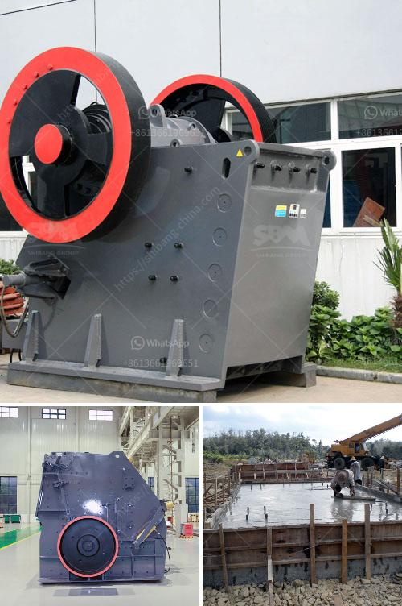

<h3>mobile gold hammer crusher for sale philippines</h3>
For the past few years, with the rapid development of the mining industry in the Philippines, the demand for mining equipment is also increasing. Crushing equipment is one of the most common and important equipment in mining operations. As a professional manufacturer of mining equipment, SBM has been focusing on the design and production of mining machines for decades. We have a wide range of crushers for sale, including mobile gold hammer crusher.

Gold is the metal with the highest value among the precious metals. With the rise in gold prices in recent years, gold mining has become one of the most promising businesses. At present, the demand for gold mining equipment is strong, and the market for gold hammer crushers is also growing. Gold hammer crusher for sale is one of the main types of crushers in a mine or ore processing plant.

SBM's gold ore hammer crusher has excellent performance and has won the trust of users. Our high-quality gold hammer crusher not only solves the shortcomings of traditional hammer crushers but also advances with the times. Our gold ore crusher has a compact structure, reasonable layout, easy installation and maintenance, and is equipped with excellent sealing system for dust prevention. It is an ideal choice for crushing various brittle materials, such as limestone, coal, salt, gypsum, brick, and tile, etc.

Compared with traditional hammer crushers, SBM's gold ore crusher has many advantages. It can directly crush the large-sized stones into smaller particles, saving transportation costs. It can crush materials with high moisture content without blocking the screen, and it can crush wet materials, which is not easy to clog the screen. The gold hammer crusher has a wide range of applications in the mining industry, especially in the gold ore recovery and beneficiation industries.

SBM's gold hammer crusher is well received by customers for its simple structure, high efficiency, low energy consumption, and low cost. It has been widely used in gold ore mining, smelting, building materials, roads, railways, water conservancy, chemical industries, and many other industries. It can crush various non-flammable and explosive materials with a compressive strength of less than 320 MPa.

In conclusion, SBM's mobile gold hammer crusher for sale in the Philippines is an ideal equipment for all miners, and it has features that attract most of their customers. If you are interested in the mining industry and want to start your own business or make a further expansion of your existing business, SBM's gold hammer crusher is a good choice for you.

With its excellent performance and reliable operation, we believe that SBM's gold hammer crusher will bring you a lot of benefits and help you achieve success in the mining industry. Don't hesitate, contact us now to get the latest price and more information about our mobile gold hammer crusher.
<h3>Contact us</h3><ul><li><strong>Whatsapp:&nbsp;<a href="https://wa.me/8613661969651">+8613661969651</a></strong></li><li><a href="https://swt.shibang-china.com/?git&amp;zhl&amp;mobile gold hammer crusher for sale philippines"><strong>Online Service(chat now)</strong></a></li></ul><h3>Related</h3><ul><li><a href='crushing machine malaysia.md'>crushing machine malaysia</a></li><li><a href='processing of bauxite ore.md'>processing of bauxite ore</a></li><li><a href='mtw 175 tanzania mill output in 325 mesh.md'>mtw 175 tanzania mill output in 325 mesh</a></li><li><a href='the largest stone crusher system.md'>the largest stone crusher system</a></li><li><a href='gravel crushers machine.md'>gravel crushers machine</a></li></ul>